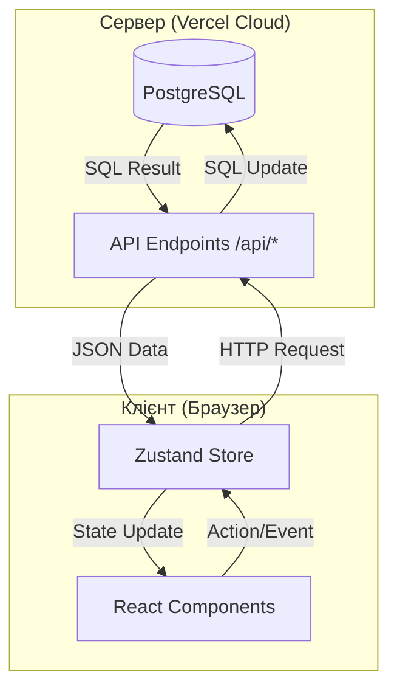
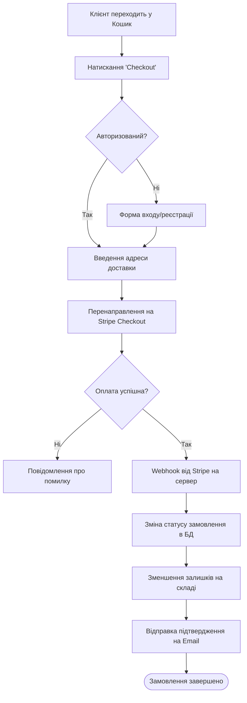

# РОЗДІЛ 1. ПОСТАНОВКА ЗАДАЧІ (SRS)

## 1.1 Вступ

### 1.1.1 Призначення, мета та межі
**Призначення:** Програмний продукт «Hristo» призначений для комплексної автоматизації діяльності спеціалізованого інтернет-магазину airsoft-обладнання. Система забезпечує повний цикл взаємодії з клієнтом: від ознайомлення з асортиментом товарів до безпечного оформлення замовлення та оплати.
**Мета:** Головною метою розробки є створення надійної та високопродуктивної веб-платформи, яка дозволить підвищити ефективність продажів шляхом автоматизації обліку товарів, спрощення процесу замовлення для користувачів та надання зручних інструментів адміністрування для власників бізнесу.
**Межі:** Функціональні межі системи включають логіку представлення товарів (фільтрація, пошук), механізми наповнення кошика, інтеграцію з платіжною системою Stripe, а також повноцінний адміністративний інтерфейс для управління базою даних (операції CRUD) без необхідності прямого втручання в структуру БД.

### 1.1.2 Посилання
- Міжнародний стандарт специфікації вимог до програмного забезпечення IEEE 830-1998, що забезпечує структуру даного документа.
- Технічна документація Stripe API, що регламентує протоколи обміну даними при проведенні фінансових транзакцій.
- Веб-адреса діючого прототипу проекту: `hristo-airsoft.vercel.app`, що використовується для валідації інтерфейсних рішень.

### 1.1.3 Означення та абревіатури
- **SRS (Software Requirements Specification)** — специфікація вимог до програмного продукту, основний документ, що описує функціональність системи.
- **CRUD (Create, Read, Update, Delete)** — стандартний набір операцій для управління даними (створення, читання, оновлення, видалення), що реалізований в адмін-панелі.
- **JWT (JSON Web Token)** — стандарт передачі даних між сервером та клієнтом для забезпечення безпечної автентифікації користувачів.

## 1.2 Загальний опис

### 1.2.1 Перспективи продукту
Продукт розроблений як масштабована веб-орієнтована система. Вона може функціонувати як самостійне рішення для малого бізнесу або стати частиною більшої екосистеми електронної комерції. Завдяки використанню хмарних технологій Vercel, система готова до миттєвого масштабування при зростанні кількості відвідувачів.

### 1.2.2 Характеристика продукту
Ключовою особливістю продукту є його вузька спеціалізація під Airsoft-тематику, що виражається в специфічних характеристиках товарів. Для користувача реалізована інтуїтивно зрозуміла логіка "Shopping Journey" (Пошук -> Кошик -> Оплата). Для адміністратора впроваджено систему управління контентом, яка дозволяє додавати нові категорії та товари, редагувати їх опис та контролювати залишки на складі в режимі реального часу.

### 1.2.3 Класи користувачів
- **Покупець (Клієнт)**: Основна група користувачів, для якої пріоритетом є швидкість роботи сайту, зручність навігації та безпека персональних даних під час оформлення покупки.
- **Адміністратор (Контент-менеджер)**: Спеціалізований клас користувачів з розширеними правами доступу, відповідальний за наповнення каталогу, модерацію відгуків та зміну статусів замовлень.

### 1.2.4 Середовище функціонування
- **Апаратна платформа**: Глобальна мережа серверів Vercel Edge Network, що забезпечує мінімальну затримку (latency) для користувачів з будь-якої точки світу.
- **Операційна система**: Кросплатформеність забезпечується роботою в сучасних веб-браузерах на базі Chromium, WebKit або Gecko.
- **Програмне забезпечення**: Серверна частина базується на Node.js Runtime версії 18+, база даних PostgreSQL забезпечує надійне зберігання реляційних структур.

## 1.3 Вимоги та особливості системи

### 1.3.1 Характеристики для варіантів використання
- **Процес покупки**: Система реалізує транзакційну логіку. При додаванні товару до кошика та переході до оплати, система резервує одиницю товару. У разі успішної відповіді від платіжного шлюзу Stripe, кількість товару на складі автоматично зменшується.
- **Процес адміністрування**: Всі критичні дії (видалення товару, зміна цін) вимагають підтвердження сесії через JWT. Адміністратор має можливість групового редагування категорій, що значно прискорює менеджмент великого каталогу.

Рис. 1. Діаграма варіантів використання (Use Case) для основних ролей системи.

### 1.3.2 Користувацькі інтерфейси
Дизайн системи виконаний у сучасному стилі "Dark Mode" з акцентом на ергономіку та читабельність. Використання адаптивної верстки дозволяє комфортно користуватися магазином як з настільних ПК, так і з мобільних пристроїв. Всі інтерактивні елементи мають візуальний відгук на дії користувача (hover-ефекти, анімації переходів), що покращує загальний користувацький досвід (UX).

### 1.3.4 Програмні інтерфейси
Зв'язок між React-фронтендом та PostgreSQL базою даних через API-ендпоінти (Vercel Functions).

### 1.3.6 Атрибути якості
- **Продуктивність**: Завдяки рендерингу на стороні клієнта (Client-Side Rendering) та оптимізації зображень, час відгуку системи на навігаційні дії не перевищує 300 мс.
- **Надійність**: Використання механізму транзакцій у PostgreSQL гарантує, що при технічному збої дані замовлення не будуть пошкоджені або втрачені.
- **Безпека**: Паролі користувачів зберігаються в хешованому вигляді, а всі передані дані захищені протоколом HTTPS з 256-бітним шифруванням. Автентифікація через JWT, захист від SQL-ін'єкцій.

### 1.3.7 Вимоги бази даних
База даних повинна забезпечувати цілісність за схемою 3НФ (третя нормальна форма), що виключає дублювання даних та аномалії при вставці чи видаленні.

### 1.3.8 Моделі аналізу
Для опису динаміки системи використовуються діаграми станів замовлення, які відображають життєвий цикл покупки від моменту створення до фінальної доставки.

Рис. 2. Діаграма станів (State Diagram) для процесу обробки замовлення.

---

# РОЗДІЛ 2. МЕТОДИ ВИРІШЕННЯ ЗАДАЧІ

## 2.1 Проектування інформаційної бази даних
Розробка інформаційної бази є ключовим етапом створення веб-платформи «Hristo», оскільки від правильності структури залежить стабільність роботи та швидкість обробки замовлень. Процес проектування було розділено на два послідовні етапи за допомогою CASE-засобу ERWin Data Modeler.

### 2.1.1 Логічне проектування та нормалізація
На етапі логічного проектування було створено схему сутностей, що відображає бізнес-правила магазину. Основною метою було приведення моделі до третьої нормальної форми (3NF) для усунення дублювання даних та аномалій оновлення. Було виділено 17 таблиць, що включають основні дані (користувачі, товари) та допоміжні довідники (бренди, статуси, методи оплати). 
Використання ієрархічного зв’язку між таблицями `Category` та `Subcategory` дозволило реалізувати необмежену вкладеність категорій. Кожна сутність отримала унікальний ідентифікатор (Primary Key), що гарантує цілісність посилань.

Рис. 4. Логічна модель даних інтернет-магазину в нотації IDEF1X.

### 2.1.2 Фізична реалізація в СУБД PostgreSQL
Фізична модель є технічним втіленням логічної схеми з урахуванням особливостей PostgreSQL. Для кожного поля було обрано оптимальний тип даних: `DECIMAL(10,2)` для цін (для уникнення помилок округлення флоат-чисел), `VARCHAR` для динамічних рядків та `JSONB` для зберігання неструктурованих технічних характеристик зброї (це дозволяє додавати нові параметри без зміни схеми БД).
На цьому етапі також було налаштовано каскадне видалення (ON DELETE CASCADE) для зв’язків, що забезпечує автоматичне очищення залежних записів (наприклад, видалення всіх картинок при видаленні товару).

Приклад реалізації каскадного зв'язку на мові SQL:
```sql
-- Створення таблиці зображень з каскадним видаленням
CREATE TABLE product_image (
    id VARCHAR(50) PRIMARY KEY,
    product_id VARCHAR(50),
    image_url VARCHAR(512) NOT NULL,
    is_main BOOLEAN DEFAULT false,
    -- При видаленні продукту, всі його фото видаляються автоматично
    CONSTRAINT fk_product 
        FOREIGN KEY(product_id) 
        REFERENCES product(id) 
        ON DELETE CASCADE
);
```

Рис. 5. Фізична модель бази даних (PostgreSQL) в ERWin Data Modeler.

## 2.2 Програмна архітектура та реалізація

### 2.2.1 Реалізація клієнтської частини (Frontend)
Клієнтська частина розроблена на базі бібліотеки React. Для забезпечення швидкодії було використано компонентний підхід, де кожна частина інтерфейсу (картка товару, кошик, фільтри) є незалежним модулем. 
Управління станом реалізовано через Zustand — легку альтернативу Redux, що дозволяє миттєво синхронізувати вміст кошика та дані користувача між сторінками. Для стилізації використано Vanilla CSS з CSS-змінними (Custom Properties), що забезпечує легку підтримку темної теми та високу швидкість рендерингу.

Рис. 6. Архітектура компонентів клієнтської частини та схема управління станом.

### 2.2.2 Реалізація серверної логіки (Backend)
Серверна частина функціонує в середовищі Node.js та розгорнута як Serverless Functions. Це означає, що кожний API-ендпоінт (наприклад, `/api/products` або `/api/orders`) є незалежним мікросервісом, який запускається лише за потреби. 
Така архітектура дозволяє витримувати високі навантаження при низьких витратах ресурсів. Взаємодія з базою даних відбувається через оптимізовані SQL-запити, що виключає оверхед від використання важких ORM-систем.

### 2.2.3 Інтеграція з платіжним шлюзом Stripe
Для обробки фінансових операцій використано Stripe Checkout. Логіка реалізована наступним чином: при натисканні кнопки «Оплатити», сервер створює платіжну сесію, резервує товари та перенаправляє користувача на захищену сторінку Stripe. Після успішної оплати Stripe надсилає Webhook (сповіщення) на наш сервер, який автоматично змінює статус замовлення на «Оплачено» та оновлює залишки на складі.

Рис. 7. Схема послідовності (Sequence Diagram) процесу оформлення та оплати замовлення.

### 2.2.4 Схеми потоків даних (DFD) через інтерфейс
Для розуміння руху інформації між компонентами системи було розроблено діаграму потоків даних. Вона демонструє взаємодію між сховищем стану (Zustand), API-шлюзом та хмарною базою даних.



### 2.2.5 Алгоритми функціонування окремих варіантів використання
Логіка роботи критичних вузлів системи представлена у вигляді блок-схем.

**Алгоритм пошуку та фільтрації товарів:**
Цей алгоритм забезпечує миттєву реакцію каталогу на дії користувача.
```mermaid
flowchart TD
    Start1([Початок пошуку]) --> Input[Введення запиту / Фільтри]
    Input --> Fetch[Запит до API /api/products]
    Fetch --> DBCheck{Дані знайдено?}
    DBCheck -- Так --> Result[Отримання масиву JSON]
    DBCheck -- Ні --> Empty[Повідомлення "Нічого не знайдено"]
    Result --> StoreUpdate[Оновлення стану Store]
    StoreUpdate --> ClientFilter[Фільтрація на стороні клієнта]
    ClientFilter --> Render[Відображення карток товарів]
    Render --> End1([Кінець])
```

**Алгоритм оформлення замовлення та оплати:**
Описує процес взаємодії з платіжною системою та оновлення залишків на складі.


## 2.3 Захист інформації та обробка виключних ситуацій
Система безпеки проекту «Hristo» побудована за принципом багатошарового захисту:
- **Автентифікація**: Використання JWT (JSON Web Tokens) дозволяє серверу ідентифікувати користувача без зберігання сесій у пам'яті, що підвищує стабільність. Токени зберігаються в захищених Cookies.
- **Middleware-захист**: Спеціальні фільтри на сервері перевіряють права доступу (Role-based access control) для кожної дії. Наприклад, звичайний користувач фізично не зможе отримати доступ до API видалення товарів.
- **Валідація**: Використання схем валідації гарантує, що в базу даних потраплять лише коректні дані (наприклад, ціна не може бути від’ємною, а номер телефону повинен відповідати масці).

Приклад програмної реалізації шлюзу захисту (Middleware) на Node.js:
```typescript
// Функція-посередник для перевірки прав доступу адміністратора
export async function adminAuthMiddleware(req: Request, res: Response, next: NextFunction) {
  try {
    const token = req.cookies['auth_token']; // Отримання JWT з Cookies
    if (!token) throw new Error('Автентифікація відсутня');

    const decoded = verifyToken(token); // Декодування та перевірка підпису JWT
    
    // Перевірка ролі користувача у навантаженні (payload) токена
    if (decoded.role !== 'admin') {
      return res.status(403).json({ error: 'Доступ заборонено: потрібні права адміністратора' });
    }

    req.user = decoded; // Передача даних користувача далі за стеком
    next(); // Перехід до виконання цільової операції (напр. видалення товару)
  } catch (error) {
    return res.status(401).json({ error: 'Недійсний токен або термін дії вичерпано' });
  }
}
```

Також на рівні клієнтської частини реалізована жорстка валідація вхідних даних за допомогою схем (наприклад, бібліотеки Zod), що запобігає відправці некоректних запитів на сервер.

Приклад валідації форми створення товару:
```typescript
import { z } from 'zod';

// Схема валідації товару
const productFormSchema = z.object({
  name: z.string().min(3, 'Назва повинна містити мінімум 3 символи'),
  price: z.number().positive('Ціна повинна бути більшою за 0'),
  stock: z.number().int().nonnegative('Залишок не може бути від’ємним'),
  category_id: z.string().min(1, 'Категорія є обов’язковою'),
  sku: z.string().regex(/^[A-Z0-9-]+$/, 'Артикул може містити лише літери та цифри')
});

// Функція обробки форми
const handleSubmit = (data) => {
  const result = productFormSchema.safeParse(data);
  if (!result.success) {
    showToasts(result.error.issues.map(i => i.message)); // Показ помилок користувачеві
    return;
  }
  // Якщо валідація успішна — відправка на сервер
  saveProduct(result.data);
};
```

## 2.4 Ергономіка та користувацький досвід (UX/UI)
При розробці інтерфейсу особливу увагу приділено ергономіці:
- **Швидкість взаємодії**: Використано технологію "Optimistic Updates" — при додаванні товару в кошик інтерфейс оновлюється миттєво, не чекаючи відповіді від сервера, що створює відчуття надзвичайно швидкого сайту.
- **Візуальний фідбек**: Впроваджено систему Toast-сповіщень та скелетон-завантажувачів (Skeleton Screens), які повідомляють користувача про статус виконання операцій.
- **Доступність**: Весь інтерфейс адаптований под управління як мишею, так і сенсорними екранами, що критично для мобільних покупців.

Приклад реалізації Optimistic Updates (Zustand):
```typescript
// Стор управління кошиком
export const useCartStore = create((set) => ({
  cartItems: [],
  
  addItem: async (product) => {
    // 1. Оптимістичне оновлення інтерфейсу (до отримання відповіді від сервера)
    set((state) => ({ cartItems: [...state.cartItems, product] }));
    
    // Візуальний фідбек користувачеві
    toast.success(`${product.name} додано до кошика!`, { icon: '🛒' });

    try {
      // 2. Фонова синхронізація з базою даних
      await api.syncCart([...state.cartItems, product]);
    } catch (error) {
      // 3. Відкат стану у разі помилки сервера
      set((state) => ({ cartItems: state.cartItems.filter(i => i.id !== product.id) }));
      toast.error('Не вдалося зберегти кошик. Спробуйте пізніше.');
    }
  }
}));
```

Рис. 8. Інтерфейс адміністратора: приклад візуального підтвердження дій та обробки помилок.

## 2.5 Висновки до другого розділу
У другому розділі було проведено детальне проектування архітектури та обґрунтовано вибір технологічного стеку для веб-платформи «Hristo». На основі аналізу вимог було розроблено логічну та фізичну моделі бази даних, які налічують 17 взаємопов’язаних таблиць та відповідають вимогам третьої нормальної форми, що гарантує надійність зберігання даних.

Було детально описано реалізацію клієнтської та серверної частин, де використання React та Zustand забезпечує високу швидкість роботи інтерфейсу, а архітектура Serverless Node.js — масштабованість системи. Окрему увагу приділено безпеці (JWT, RBAC) та інтеграції з платіжною системою Stripe, що дозволило автоматизувати повний цикл продажу товарів. 

Обрані методи проектування та програмні інструменти створюють стійку основу для подальшої технічної реалізації та успішного розгортання проекту.

---

# РОЗДІЛ 3. ІНСТРУКЦІЯ КОРИСТУВАЧА

Даний розділ містить детальний опис режимів експлуатації веб-платформи «Hristo» для двох основних груп користувачів: клієнтів та адміністраторів.

## 3.1 Інструкція користувача (Клієнт)

Навігація для клієнта забезпечує доступ до функцій покупки та управління власними даними:

1. **Введення та редагування даних:**
    a. **Кошик**: Додавання товарів та зміна їх кількості перед замовленням.
    b. **Дані одержувача**: Введення ПІБ, телефону та адреси доставки при чекауті.
    c. **Платіжні дані**: Введення реквізитів карти у захищеному вікні Stripe.
    d. **Відгуки**: Написання коментарів та виставлення оцінок товарам.

2. **Запити:**
    a. **Актуальна ціна**: Перегляд вартості товару з урахуванням діючих знижок.
    b. **Статус замовлення**: Отримання інформації про поточний стан покупки (Оплачено/Відправлено).
    c. **Наявність**: Перегляд статусу "В наявності" або "Під замовлення" на картці товару.

3. **Пошук та фільтрація даних:**
    a. **Глобальний пошук**: Пошук Airsoft-обладнання за назвою у шапці сайту.
    b. **Фільтрація каталогу**: Відбір товарів за категорією, брендом та ціною.
    c. **Сортування**: Впорядкування товарів за рейтингом або зростанням ціни.

4. **Звіти:**
    a. **Історія замовлень**: Перегляд переліку всіх раніше здійснених покупок.
    b. **Підтвердження оплати**: Отримання квитанції від платіжної системи після транзакції.

## 3.2 Інструкція користувача (Адміністратор)

Адміністративна панель забезпечує повний контроль над контентом та бізнес-процесами:

1. **Введення та редагування даних:**
    a. **Каталог товарів**: Створення нових позицій, редагування цін та SKU.
    b. **Категорії та бренди**: Налаштування структури магазину та списку виробників.
    c. **Складський облік**: Введення та корекція кількості одиниць товару на складі.
    d. **Користувачі**: Управління обліковими записами та призначення ролей.

2. **Запити:**
    a. **Менеджмент замовлень**: Перегляд черги нових замовлень для обробки.
    b. **Транзакції Stripe**: Перевірка успішності проходження платежів через адмін-панель.
    c. **Логи дій**: Перегляд історії змін, внесених іншими менеджерами.

3. **Пошук та фільтрація даних:**
    a. **Пошук клієнтів**: Пошук за базою покупців за email або номером телефону.
    b. **Фільтрація замовлень**: Відбір покупок за датою, сумою або статусом оплати.
    c. **Пошук по складу**: Швидкий пошук товару за артикулом для оновлення залишків.

4. **Звітність:**
    a. **Фінансовий звіт**: Формування звіту про дохід за довільний період.
    b. **Аналітика продажів**: Визначення найбільш популярних товарів ("Хітів продажу").
    c. **Інвентаризаційний звіт**: Список товарів, які потребують закупівлі.

## 3.3 Опис процедур звернення до допомоги

Для вирішення питань щодо експлуатації системи передбачено наступні механізми:
- **Підказки інтерфейсу**: Спливаючі вікна з описом функцій кнопок.
- **Система Toast-сповіщень**: Миттєві повідомлення про успіх або помилку операції.
- **Документація**: Вбудований розділ FAQ для клієнтів та довідка по адмін-панелі для персоналу.
- **Валідація**: Автоматична перевірка коректності введених даних у формах.

---

# ВИСНОВКИ

У ході виконання курсової роботи було успішно розроблено та спроектовано сучасну веб-платформу для спеціалізованого інтернет-магазину airsoft-обладнання «Hristo». Робота охопила повний життєвий цикл створення програмного продукту, починаючи від детального аналізу функціональних вимог і закінчуючи розробкою інструкцій з експлуатації для різних категорій користувачів. Основним результатом проектування стала надійна інформаційна база даних, створена за допомогою CASE-засобу ERWin Data Modeler, яка налічує сімнадцять взаємопов’язаних сутностей, приведених до третьої нормальної форми для забезпечення цілісності та мінімізації надмірності даних.

Обраний технологічний стек, що включає бібліотеку React.js для побудови динамічного фронтенду та середовище Node.js для серверної логіки, дозволив реалізувати високоефективний додаток із миттєвим відгуком інтерфейсу. Завдяки впровадженню технології оптимістичних оновлень та сучасних засобів управління станом, було досягнуто високого рівня продуктивності та позитивного користувацького досвіду. Важливою частиною проекту стала інтеграція з платіжним шлюзом Stripe, що забезпечило безпеку фінансових транзакцій та автоматизацію бізнес-процесів через механізм вебхуків.

Система безпеки, побудована на базі автентифікації за допомогою JWT-токенів та рольової моделі доступу, гарантує надійне розмежування прав між покупцями та адміністраторами. Розроблений інтерфейс характеризується високою ергономічністю, наявністю інтелектуального пошуку та гнучкої системи фільтрації товарів. Практична значущість отриманих результатів полягає у створенні повнофункціонального програмного рішення, яке повністю автоматизує роботу онлайн-магазину та є готовим до розгортання і подальшого масштабування в реальних ринкових умовах.

---

# СПИСОК ВИКОРИСТАНИХ ДЖЕРЕЛ

1. ДСТУ 8302:2015. Інформація та документація. Бібліографічне посилання. Загальні положення та правила складання. – [Чинний від 2016-07-01]. – Київ : Держспоживстандарт України, 2016. – 17 с.
2. Connolly T. Database Systems: A Practical Approach to Design, Implementation, and Management / T. Connolly, C. Begg. – 6th ed. – Boston : Addison-Wesley, 2014. – 1440 p.
3. React Documentation : official website. – URL: https://react.dev (accessed: 20.04.2026).
4. Node.js v20.x Documentation : official documentation. – URL: https://nodejs.org/docs/latest-v20.x/api/ (accessed: 22.04.2026).
5. PostgreSQL 16 Documentation : official website. – URL: https://www.postgresql.org/docs/16/index.html (accessed: 18.04.2026).
6. Stripe API Reference : technical documentation. – URL: https://stripe.com/docs/api (accessed: 25.04.2026).
7. Wieruch R. The Road to React / Robin Wieruch. – Berlin : Leanpub, 2021. – 340 p.
8. MDN Web Docs : open web resource for developers. – URL: https://developer.mozilla.org (accessed: 15.04.2026).
9. JSON Web Token (JWT) Specification RFC 7519. – URL: https://datatracker.ietf.org/doc/html/rfc7519 (accessed: 26.04.2026).
10. Beck K. Test Driven Development: By Example / Kent Beck. – Boston : Addison-Wesley, 2002. – 240 p.
11. Vercel Documentation : cloud infrastructure and deployment. – URL: https://vercel.com/docs (accessed: 27.04.2026).
12. Марченко О. І. Проектування баз даних : навчальний посібник / О. І. Марченко. – Київ : НТУУ «КПІ», 2015. – 180 с.
13. Симоненко В. П. Сучасні технології розробки веб-застосувань : конспект лекцій / В. П. Симоненко. – Київ : КНЕУ, 2019. – 156 с.
14. Еванс Д. Предметно-орієнтоване проектування (DDD): Тактика вивільнення складності складних систем / Ерік Еванс. – Київ : Альтінформ, 2017. – 624 с.
15. Martin R. C. Clean Architecture: A Craftsman's Guide to Software Structure and Design / Robert C. Martin. – Upper Saddle River : Prentice Hall, 2017. – 432 p.
16. Hunt A. The Pragmatic Programmer: From Journeyman to Master / Andrew Hunt, David Thomas. – Upper Saddle River : Prentice Hall, 2000. – 352 p.
17. Regulation (EU) 2016/679 of the European Parliament and of the Council of 27 April 2016 on the protection of natural persons with regard to the processing of personal data (General Data Protection Regulation). – Official Journal of the European Union, 2016. – L 119. – P. 1–88.
18. Directive 2000/31/EC of the European Parliament and of the Council of 8 June 2000 on certain legal aspects of information society services, in particular electronic commerce, in the Internal Market (Directive on electronic commerce). – Official Journal of the European Communities, 2000. – L 178. – P. 1–16.
19. Zakon o elektroničkoj trgovini (Narodne novine, br. 173/03, 67/08, 36/09, 130/11, 30/14, 32/19). – Zagreb : Sabor Republike Hrvatske. [Закон Хорватії про електронну комерцію].
20. Zakon o zaštiti potrošača (Narodne novine, br. 19/22). – Zagreb : Sabor Republike Hrvatske. [Закон Хорватії про захист прав споживачів].
21. Directive 2011/83/EU of the European Parliament and of the Council of 25 October 2011 on consumer rights. – Official Journal of the European Union, 2011. – L 304. – P. 64–88.
22. Zakon o obveznim odnosima (Narodne novine, br. 35/05, 41/08, 127/13, 74/14, 94/14). – Zagreb : Sabor Republike Hrvatske. [Закон Хорватії про зобов'язальні відносини].
23. Ustav Republike Hrvatske (Narodne novine, br. 56/90, 135/97, 113/00, 76/10, 85/10). – Zagreb : Sabor Republike Hrvatske. [Конституція Хорватії].
24. Martin R. C. Clean Code: A Handbook of Agile Software Craftsmanship / Robert C. Martin. – Upper Saddle River : Prentice Hall, 2008. – 464 p.
25. Beck K. Extreme Programming Explained: Embrace Change / Kent Beck. – Boston : Addison-Wesley, 2000. – 224 p.
26. Hunt A. The Pragmatic Programmer: Your Journey to Mastery, 20th Anniversary Edition / Andrew Hunt, David Thomas. – 20th Anniversary ed. – Pragmatic Bookshelf, 2020. – 432 p.
27. Vercel Documentation : cloud infrastructure and deployment. – URL: https://vercel.com/docs (accessed: 27.04.2026).
28. Марченко О. І. Проектування баз даних : навчальний посібник / О. І. Марченко. – Київ : НТУУ «КПІ», 2015. – 180 с.
29. Симоненко В. П. Сучасні технології розробки веб-застосувань : конспект лекцій / В. П. Симоненко. – Київ : КНЕУ, 2019. – 156 с.
30. Еванс Д. Предметно-орієнтоване проектування (DDD): Тактика вивільнення складності складних систем / Ерік Еванс. – Київ : Альтінформ, 2017. – 624 с.
31. Martin R. C. Clean Architecture: A Craftsman's Guide to Software Structure and Design / Robert C. Martin. – Upper Saddle River : Prentice Hall, 2017. – 432 p.
32. Hunt A. The Pragmatic Programmer: From Journeyman to Master / Andrew Hunt, David Thomas. – Upper Saddle River : Prentice Hall, 2000. – 352 p.
33. Regulation (EU) 2016/679 of the European Parliament and of the Council of 27 April 2016 on the protection of natural persons with regard to the processing of personal data (General Data Protection Regulation). – Official Journal of the European Union, 2016. – L 119. – P. 1–88.
34. Directive 2000/31/EC of the European Parliament and of the Council of 8 June 2000 on certain legal aspects of information society services, in particular electronic commerce, in the Internal Market (Directive on electronic commerce). – Official Journal of the European Communities, 2000. – L 178. – P. 1–16.
35. Zakon o elektroničkoj trgovini (Narodne novine, br. 173/03, 67/08, 36/09, 130/11, 30/14, 32/19). – Zagreb : Sabor Republike Hrvatske. [Закон Хорватії про електронну комерцію].
36. Zakon o zaštiti potrošača (Narodne novine, br. 19/22). – Zagreb : Sabor Republike Hrvatske. [Закон Хорватії про захист прав споживачів].
37. Directive 2011/83/EU of the European Parliament and of the Council of 25 October 2011 on consumer rights. – Official Journal of the European Union, 2011. – L 304. – P. 64–88.
38. Zakon o obveznim odnosima (Narodne novine, br. 35/05, 41/08, 127/13, 74/14, 94/14). – Zagreb : Sabor Republike Hrvatske. [Закон Хорватії про зобов'язальні відносини].
39. Ustav Republike Hrvatske (Narodne novine, br. 56/90, 135/97, 113/00, 76/10, 85/10). – Zagreb : Sabor Republike Hrvatske. [Конституція Хорватії].

---

# ГРАФІЧНИЙ МАТЕРІАЛ

Рис. 9. Схеми потоків даних, що надходять до користувача через інтерфейс.

Рис. 10. Алгоритми функціонування окремих варіантів використання продукту.

Рис. 11. Схеми потоків даних, використовувані при формуванні документів.

Рис. 12. Зразки заповнених форм документів.
