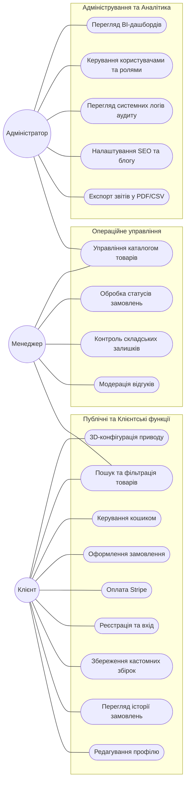
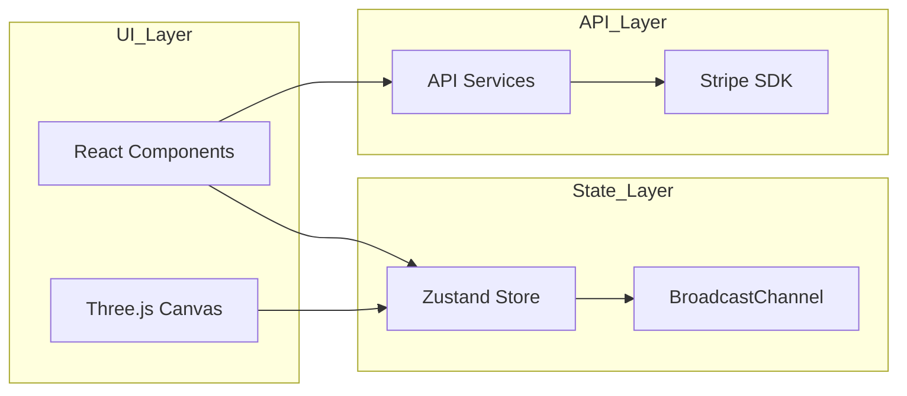
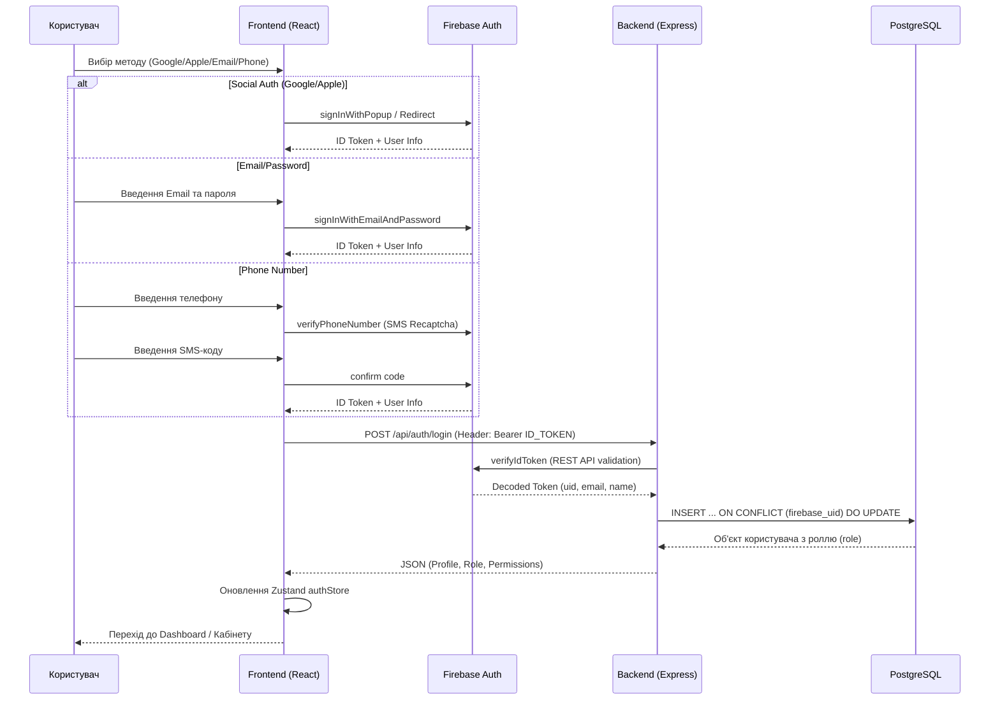
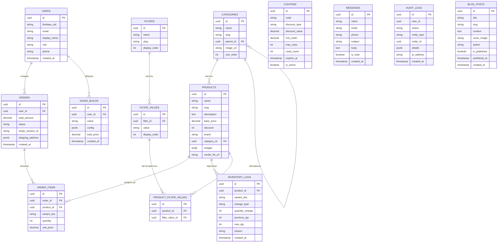
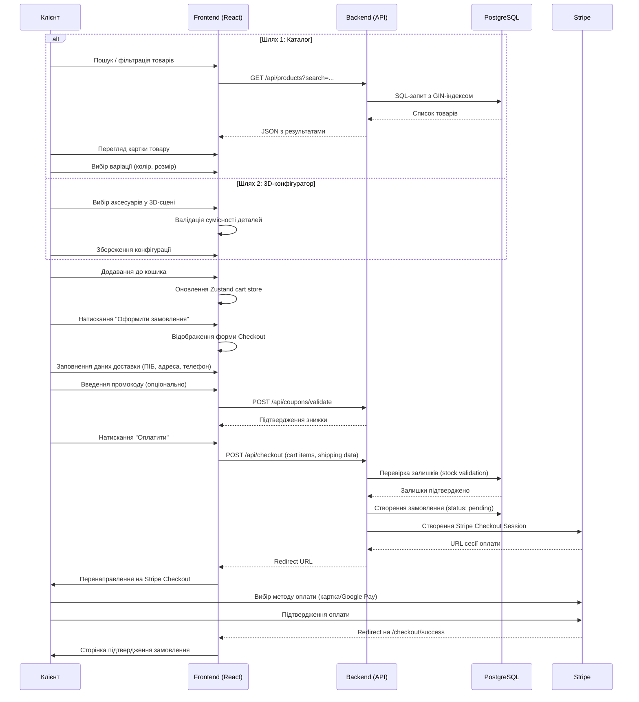
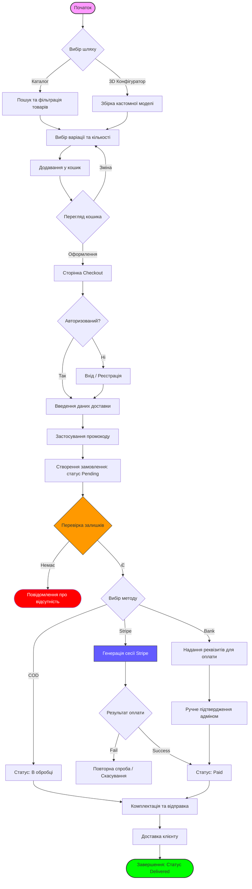
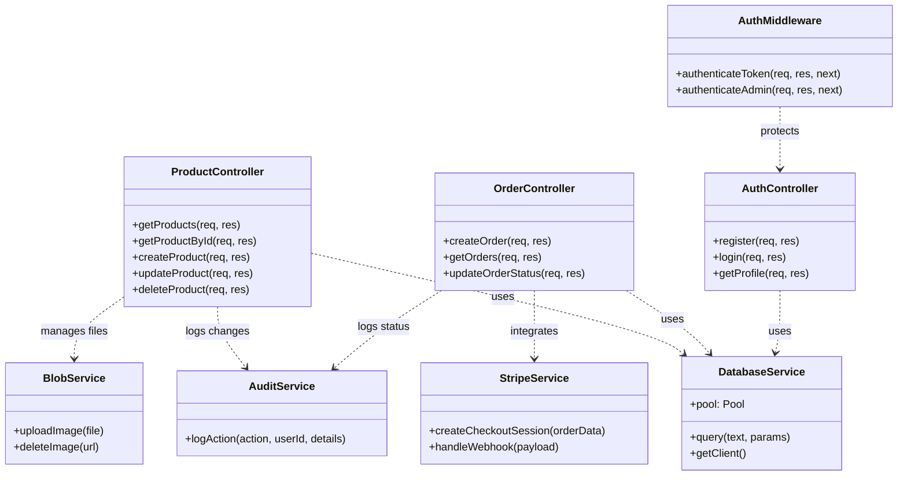
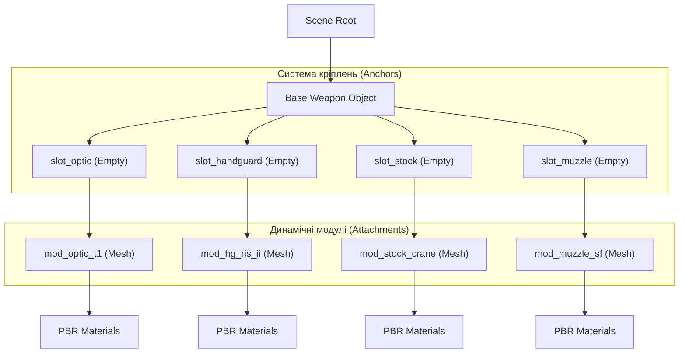
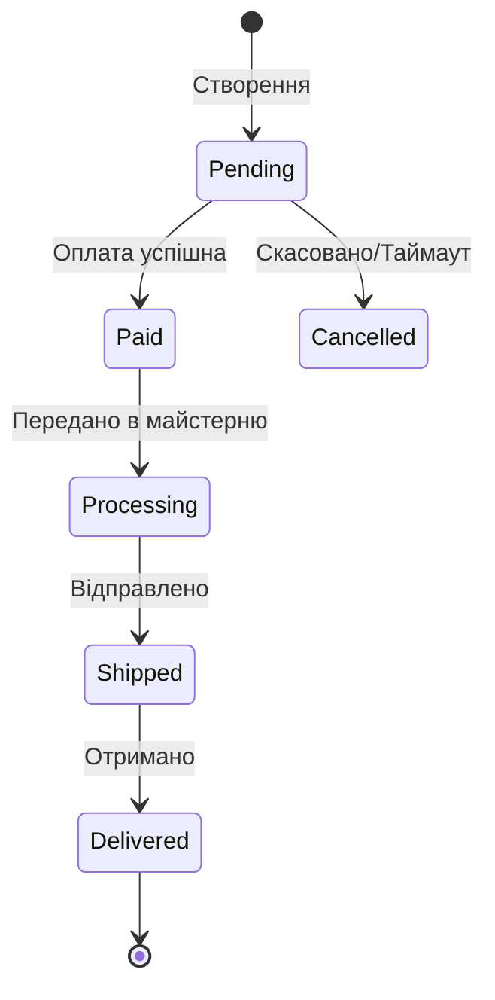

# МІНІСТЕРСТВО ОСВІТИ І НАУКИ УКРАЇНИ
# НАЦІОНАЛЬНИЙ УНІВЕРСИТЕТ ХАРЧОВИХ ТЕХНОЛОГІЙ
# Факультет автоматизації і комп'ютерних систем імені проф. І.В.Ельперіна

**ПОЯСНЮВАЛЬНА ЗАПИСКА**
**ДО КВАЛІФІКАЦІЙНОЇ РОБОТИ БАКАЛАВРА**

**Тема:** РОЗРОБЛЕННЯ СПЕЦІАЛІЗОВАНОЇ СИСТЕМИ ЕЛЕКТРОННОЇ КОМЕРЦІЇ ДЛЯ ТАКТИЧНОГО СПОРЯДЖЕННЯ З ІНТЕГРОВАНИМ 3D-КОНФІГУРАТОРМ ТА МОДУЛЕМ БІЗНЕС-АНАЛІТИКИ

---

### ЗАВДАННЯ НА КВАЛІФІКАЦІЙНУ РОБОТУ

**3. Вихідні дані до роботи:**
1. Організаційна структура та регламент діяльності магазину тактичного спорядження "Hristo Airsoft".
2. Технічні специфікації та параметри сумісності страйкбольного обладнання (інтерфейси Picatinny, M-LOK, KeyMod).
3. Набір 3D-моделей спорядження у форматах GLB/GLTF та відповідні карти PBR-текстур.
4. Технічна документація платіжної системи Stripe API та хмарних сервісів Vercel Blob/Neon PostgreSQL.
5. Державні стандарти України: ДСТУ 3008:2015 (Звіти у сфері науки і техніки), ДСТУ ISO/IEC 12207:2008 (Процеси життєвого циклу ПЗ).
6. Методичні вказівки кафедри інформаційних систем НУХТ до виконання кваліфікаційних робіт.
7. Прототипи інтерфейсів та користувацькі сценарії (User Stories) для системи електронної комерції.

**4. Зміст пояснювальної записки (перелік питань, які потрібно розробити):**
Вступ;
Розділ 1. Дослідження предметної області та постановка задачі;
Розділ 2. Технічне завдання;
Розділ 3. Розроблення програмного продукту;
Висновки.

**5. Перелік графічного матеріалу:**
- Схема організаційної структури магазину;
- Діаграма потоків даних (DFD) системи;
- Діаграма варіантів використання (Use Case);
- Алгоритм роботи модуля генерації SKU (Activity);
- Схема компонентів фронтенд-архітектури;
- ER-діаграма структури бази даних;
- Діаграма послідовності взаємодії з платіжним шлюзом (Sequence);
- Схема ієрархії 3D-сцени (Scene Graph);
- Діаграма станів життєвого циклу замовлення (State Machine);
- Схема розгортання системи в хмарній інфраструктурі (Deployment);
- Календарний план проекту (діаграма Ганта).

---

## ВСТУП

**Актуальність теми.** В умовах стрімкого зростання глобального ринку електронної комерції, який за даними Statista досягнув обсягу 6.3 трлн доларів у 2024 році, спеціалізовані нішеві ринки потребують інноваційних підходів до організації онлайн-продажів. Ринок страйкбольного спорядження (airsoft equipment) демонструє стійке зростання на рівні 7-10% щорічно, обумовлене популяризацією тактичних видів спорту та зростанням інтересу до мілітарі-симуляцій. Однак специфіка цієї продуктової категорії полягає у її високій технічній складності: кожна модель електропневматичної зброї (AEG) має десятки сумісних аксесуарів, що підключаються через стандартизовані інтерфейси (Picatinny, M-LOK, KeyMod). Помилковий підбір комплектуючих призводить до повернень товарів та зниження лояльності клієнтів.

Традиційні методи торгівлі через статичні веб-каталоги з двовимірними фотографіями не забезпечують достатнього рівня наочності та занурення, що ускладнює прийняття рішення покупцем. За статистикою галузі, частка повернень через "невідповідність очікуванням" у сегменті тактичного обладнання сягає 15-20%, що суттєво перевищує середній показник e-commerce (8-10%). Це обумовлює необхідність впровадження інтерактивних технологій 3D-візуалізації безпосередньо в процес покупки.

**Мета і задачі дослідження.** Метою даної кваліфікаційної роботи є проектування та реалізація високопродуктивного програмного комплексу, який інтегрує тривимірну візуалізацію безпосередньо в процес вибору товару, автоматизує управління складськими запасами та надає власнику бізнесу інструменти глибокої аналітики.

Для досягнення поставленої мети необхідно вирішити наступні задачі:
1. Дослідити предметну область та проаналізувати існуючі рішення для нішевого e-commerce.
2. Спроектувати архітектуру Full-stack веб-платформи з використанням сучасного стеку технологій.
3. Розробити 3D-конфігуратор на базі Three.js для інтерактивної візуалізації товарів.
4. Реалізація модуля ERP для автоматичної генерації SKU на основі алгоритму декартового добутку.
5. Інтегрувати модуль BI-аналітики для моніторингу ключових метрик продажів.
6. Забезпечити безпеку транзакцій через інтеграцію з платіжним шлюзом Stripe (PCI DSS Level 1).
7. Провести тестування та апробацію розробленої системи.

**Об'єкт дослідження** — процеси електронної комерції у сфері реалізації тактичного спорядження.

**Предмет дослідження** — методи та засоби автоматизації онлайн-продажів з використанням тривимірної візуалізації та модулів бізнес-аналітики.

**Методи дослідження:** структурний аналіз (DFD, IDEF0), об'єктно-орієнтоване проектування (UML), методологія порівняльного аналізу програмних рішень, модульне тестування (Vitest), інтеграційне тестування REST API.

**Практичне значення отриманих результатів** полягає у створенні працездатної e-commerce платформи, яка може бути безпосередньо використана для комерційної діяльності магазину Hristo Airsoft, а також адаптована для інших нішевих ринків із подібною бізнес-логікою (тюнінг автомобілів, велосипедні компоненти, комп'ютерне обладнання).

---

## РОЗДІЛ 1. ДОСЛІДЖЕННЯ ПРЕДМЕТНОЇ ОБЛАСТІ ТА ПОСТАНОВКА ЗАДАЧІ

### 1.1. Загальна характеристика магазину страйкбольного спорядження "Hristo Airsoft"

Підприємство "Hristo Airsoft" спеціалізується на дистрибуції, реалізації та технічному обслуговуванні високотехнологічного страйкбольного (airsoft) обладнання, тактичного спорядження та супутніх комплектуючих. Компанія була заснована у 2018 році в місті Загреб (Хорватія) як вузькоспеціалізований офлайн-магазин для місцевих ентузіастів військово-тактичних ігор. Протягом кількох років діяльності підприємство масштабувалося, зайнявши лідируючі позиції в регіональному сегменті ринку та розширивши свою діяльність на ринок Європейського Союзу, що вимагало розгортання цифрових каналів дистрибуції.

**Головною метою діяльності** підприємства є забезпечення клієнтів (як індивідуальних гравців, так і професійних спортивних команд та організаторів тактичних симуляцій) високоякісними, технічно сумісними репліками зброї, сертифікованими засобами захисту та професійним тюнінгом.

**Сфера діяльності** компанії "Hristo Airsoft" охоплює такі напрями:
1. **Роздрібна та дрібнооптова торгівля:** продаж електропневматичних (AEG), газових (GBB/GBBR) та спрінгових (Spring) реплік зброї, тактичного одягу, взуття, захисних масок, окулярів та розвантажувальних систем.
2. **Технічний тюнінг та кастомізація:** професійне сервісне обслуговування страйкбольних приводів, модернізація внутрішніх вузлів (гірбоксів, стволиків, хоп-апів, моторів) для підвищення дальності, точності та скорострільності.
3. **Консалтингова діяльність:** надання експертних рекомендацій щодо збирання індивідуальних комплектів спорядження відповідно до стандартів конкретних страйкбольних правил та військово-тактичних симуляцій (MilSim).

**Особливості діяльності та продукту.** Специфіка товарного асортименту "Hristo Airsoft" полягає у його надзвичайно високій технічній складності та варіативності. На відміну від класичного e-commerce, де товари є унітарними, страйкбольний привід є модульною системою. Наприклад, базова репліка гвинтівки типу M4A1 може мати десятки варіацій зовнішнього обвісу (оптичні, коліматорні приціли, лазерні цілевказівники, тактичні ліхтарі, цівки стандартів Picatinny, M-LOK, KeyMod, глушники, руків'я, приклади). Більшість цих компонентів мають обмежену сумісність. Продаж окремих деталей без перевірки їх сумісності з конкретною реплікою призводить до високого рівня повернень та рекламацій.

**Продуктова лінійка** підприємства охоплює наступні категорії:

| Категорія | Приклади товарів | Частка в обороті |
|-----------|-----------------|------------------|
| Електропневматичні приводи (AEG) | Репліки M4A1, AK-74, G36, MP5, SR-25 | ~45% |
| Газові приводи (GBB/GBBR) | Пістолети Glock, Hi-Capa, репліки карабінів M4 | ~20% |
| Оптичні та прицільні пристрої | Red Dot коліматори, приціли ACOG, LPVO | ~15% |
| Тактичні аксесуари | Ліхтарі, ЛЦВ, сошки, глушники, ремені | ~10% |
| Внутрішній тюнінг та запчастини | Гірбокси, тонкі стволики, мотори, шестерні | ~10% |

**Цільова аудиторія** складається з трьох ключових сегментів:
- *Початківці (Новачки):* потребують комплексних рішень "з коробки" та детального консультування щодо сумісності базових аксесуарів (акумуляторів, зарядних пристроїв, магазинів).
- *Досвідчені гравці (Страйкболісти-індивідуали):* самостійно модернізують своє спорядження, підбирають специфічні комплектуючі та орієнтуються на точні технічні параметри (довжина стволика, тип різьби глушника, інтерфейс цівки).
- *Професійні команди та колекціонери:* замовляють дорогі кастомні збірки, унікальний зовнішній тюнінг та лімітовані репліки, висуваючи підвищені вимоги до візуальної відповідності та автентичності кожної деталі.

---

### 1.2. Організаційна структура магазину "Hristo Airsoft", роль і взаємодія підрозділів

#### 1.2.1. Загальна схема організаційної структури

Організаційна структура підприємства "Hristo Airsoft" побудована за лінійно-функціональним принципом. Такий тип структури забезпечує чітке розділення управлінської праці, швидке прийняття рішень на лінійних рівнях та високу професійну спеціалізацію функціональних підрозділів. Загальна схема організаційної структури та управлінської вертикалі підприємства наведена на рисунку 1.1.

**Рисунок 1.1 — Схема організаційної структури підприємства "Hristo Airsoft" з виділенням об'єкта автоматизації**

```mermaid
graph TD
    CEO[Директор / Власник] --> Accounting[Бухгалтерія та Фінанси]
    CEO --> SalesDept[Відділ продажів та обслуговування]
    CEO --> Workshop[Технічний відділ / Майстерня]
    CEO --> Logistics[Складська служба та Логістика]
    
    subgraph Automated_System [Сфера автоматизації створюваної системи]
        SalesDept --> OnlineStore[Інтернет-магазин та обробка замовлень]
        SalesDept --> OfflineRetail[Роздрібний магазин (Шоурум)]
        Workshop --> CustomBuilds[Збирання кастомних 3D-збірок]
        Logistics --> StockTracking[Контроль складських залишків]
    end

    style Automated_System fill:#f4f7f6,stroke:#635bff,stroke-width:2px,stroke-dasharray: 5 5
    style OnlineStore fill:#e3f2fd,stroke:#0d47a1,stroke-width:2px
    style CustomBuilds fill:#e8f5e9,stroke:#1b5e20,stroke-width:2px
    style StockTracking fill:#fff3e0,stroke:#e65100,stroke-width:2px
```

Як відомо з рис. 1.1, вище керівництво здійснює стратегічний контроль через чотири ключові функціональні підрозділи:
- **Бухгалтерія та Фінанси:** забезпечує фінансовий облік, сплату податків, нарахування заробітної плати та аудит загальної прибутковості компанії.
- **Відділ продажів:** є основним комерційним вузлом, що взаємодіє з покупцями, обробляє запити, формує замовлення та забезпечує супровід клієнтів. Саме в його межах функціонує підрозділ **Інтернет-магазину та обробки замовлень**, який виступає головним об'єктом автоматизації.
- **Технічний відділ (Майстерня):** відповідає за технічний контроль, ремонт, передпродажну підготовку та збирання складних кастомних конфігурацій за запитами клієнтів.
- **Складська служба та Логістика:** виконує приймання поставок, маркування, адресне зберігання, комплектування замовлень та взаємодію з поштовими службами доставки (GLS, DPD).

---

#### 1.2.2. Структура відділу онлайн-продажів та обслуговування замовлень (який автоматизується)

Підрозділ онлайн-продажів та обслуговування замовлень є сполучною ланкою між кінцевим споживачем та іншими службами магазину. До його складу входять менеджери з продажу, технічні майстри-консультанти та завідувач складу (в частині комплектації відправлень).

**Посадові обов'язки працівників підрозділу:**
1. **Менеджер з онлайн-продажів:**
   - Приймання та верифікація замовлень, що надходять через веб-сайт.
   - Консультування клієнтів через канали комунікації (телефон, email, месенджери).
   - Ручна перевірка наявності товарів на складі та узгодження сумісності компонентів.
   - Виставлення рахунків на оплату, контроль проведення платежів.
   - Оформлення супровідної документації (накладних) для складської служби.
2. **Технічний спеціаліст (Майстер-тюнер):**
   - Технічна перевірка замовлень на кастомні приводи перед їх відправкою на склад.
   - Збирання індивідуальних конфігурацій зброї (встановлення оптики, ліхтарів, внутрішнього тюнінгу).
   - Тестування початкової швидкості вильоту кулі (хронографування) та ведення технічного паспорта виробу.
3. **Комірник (Завідувач складу):**
   - Підготовка та пакування товарів згідно зі складальним листом від менеджера.
   - Оновлення інформації про залишки товарів при вибутті або надходженні нових партій.
   - Друк поштових маркувань та передача замовлень кур'єрським службам.

Для детального розуміння операційної діяльності підрозділу, що автоматизується, розроблено інформаційну матрицю взаємодії (табл. 1.2).

**Таблиця 1.2 — Інформаційні потоки відділу онлайн-продажів та обслуговування замовлень**

| Підрозділ-джерело | Вхідна інформація | Опис та призначення | Підрозділ-отримувач | Вихідна інформація | Опис та призначення |
| :--- | :--- | :--- | :--- | :--- | :--- |
| **Клієнт (Покупець)** | Запит на покупку, реквізити доставки, параметри кастомної збірки | Ініціація процесу купівлі, формування вимог до замовлення | **Клієнт (Покупець)** | Рахунок на оплату (інвойс), статус замовлення, трек-номер доставки | Фінансове закриття угоди, сповіщення про хід виконання замовлення |
| **Складська служба** | Звіти про фактичні залишки товарів, акти приймання поставок | Контроль можливості відвантаження, оновлення асортименту | **Складська служба** | Складальний лист, ТТН, інструкція з пакування | Ініціація фізичного відвантаження та пакування посилки |
| **Технічна майстерня** | Акти технічного стану, результати замірів швидкості вильоту кулі | Підтвердження працездатності, готовність кастомної збірки | **Технічна майстерня** | Технічне завдання на збирання та тюнінг привода | Специфікація кастомного замовлення для фізичної збірки майстром |
| **Директор / Бухгалтерія**| Затверджені прайс-листи, маркетингові купони, ліміти знижок | Встановлення комерційних правил та ціноутворення | **Директор / Бухгалтерія**| Звіти про продажі, реєстри оплачених рахунків | Аналіз фінансових результатів та податковий облік |

---

### 1.3. Аналіз нинішнього стану комп’ютеризації магазину "Hristo Airsoft"

Дослідження поточного стану інформатизації та технічного забезпечення магазину "Hristo Airsoft" виявило низький рівень інтеграції цифрових систем. На даний момент підприємство використовує фрагментарний набір програмного забезпечення, що не має єдиної шини обміну даними та спільного сховища.

**Поточна архітектура програмного забезпечення:**
- *Облік складських залишків:* здійснюється за допомогою ручного ведення таблиць Google Sheets. Оновлення даних проводиться працівником складу в кінці робочого дня або безпосередньо в процесі інвентаризації.
- *Комунікація та обробка замовлень:* клієнтські запити збираються через базову статичну веб-сторінку, але фінальне узгодження, виставлення реквізитів та перевірка сумісності відбуваються вручну в месенджерах (Telegram, Viber) та через телефонні дзвінки.
- *Фінансовий облік:* ведеться бухгалтером у локальній версії програми обліку, дані в яку вносяться вручну на основі банківських виписок раз на тиждень.
- *Збереження технічної документації:* креслення сумісності та інструкції зберігаються у хмарному сховищі Google Drive у форматі неструктурованих PDF-файлів.

**Аналіз виявлених дефіцитів та недоліків існуючого стану:**
1. **Висока ймовірність інформаційної асиметрії:** оскільки складський облік у Google Sheets не синхронізований з веб-сайтом у реальному часі, часто виникає ситуація "double selling" (подвійного продажу). Це коли два клієнти купують одну й ту саму дефіцитну позицію товару, яка фактично залишилась у єдиному екземплярі на складі, що призводить до скасувань, повернення коштів та репутаційних втрат.
2. **Критичний рівень людського фактора при валідації сумісності:** перевірка того, чи підходить конкретний приціл до певного типу кронштейна чи цівки, повністю лежить на менеджері. Менеджер змушений шукати технічні специфікації в PDF-каталогах виробників. При великому потоці замовлень менеджер припускається помилок (до 12% замовлень із кастомними комплектуючими містять несумісні деталі). Це спричиняє додаткові логістичні витрати на зворотну доставку товару від клієнта та його повторне відправлення за рахунок компанії.
3. **Низька ефективність бізнес-процесу формування SKU:** при надходженні нових варіацій (наприклад, одна модель автомата в 3 кольорах та з 4 різними варіантами комплектації прикладу) менеджер вручну генерує унікальні артикули (SKU) за допомогою онлайн-генераторів тексту. Це призводить до дублювання кодів, помилок у базі даних та ускладнює подальший облік залишків.
4. **Повна відсутність аналітичних інструментів:** керівництво не має можливості оперативно відстежувати бізнес-показники (динаміку доходів, середній чек, конверсію, популярність окремих брендів чи категорій). Формування звітів вимагає ручного експорту таблиць бухгалтером та займає від 2 до 5 днів, що унеможливлює швидке прийняття управлінських рішень.

**Висновок:** Нинішній стан комп'ютеризації підприємства "Hristo Airsoft" є **абсолютно незадовільним**. Наявне програмне забезпечення не покриває критичних інформаційних потреб бізнесу, має суттєві недоліки в надійності збереження даних, створює високі операційні ризики через людський фактор та гальмує масштабування компанії на європейському ринку. Це обґрунтовує гостру необхідність розроблення та впровадження спеціалізованої інтегрованої системи електронної комерції.

---

### 1.4. Функціональне моделювання та аналіз існуючих бізнес-процесів

#### 1.4.1. Функціональна модель (IDEF0) бізнес-процесів

Для детального аналізу та документування існуючих бізнес-процесів (модель AS-IS) було побудовано функціональну модель відповідно до стандарту IDEF0. Модель дозволяє представити діяльність підприємства у вигляді ієрархічного набору взаємопов'язаних функцій (блоків) з визначенням вхідних та вихідних потоків даних, керуючих регламентів та виконавчих механізмів.

**Опис контекстної діаграми A0 "Здійснення торговельної діяльності та кастомізації спорядження" (наведена в Додатку А):**
- **Вхідна інформація (Input):** запити клієнтів на покупку, вихідні страйкбольні приводи (AEG/GBB), окремі аксесуари та запчастини для тюнінгу, що надходять від постачальників.
- **Керуюча інформація (Control):** Закон України "Про електронну комерцію" (або відповідні директиви ЄС щодо торгівлі), технічні стандарти сумісності кріплень (Picatinny MIL-STD-1913, M-LOK, KeyMod), внутрішні прайс-листи магазину, правила безпеки поводження зі страйкбольним обладнанням.
- **Виконавчі механізми (Mechanism):** менеджер інтернет-магазину, технічний майстер-тюнер, комірник складу, а також наявні персональні комп'ютери (ПК) з доступом до Google Sheets.
- **Вихідна інформація (Output):** продане та перевірене страйкбольне спорядження, зібрані кастомні конфігурації, супровідні фінансові документи (інвойси, чеки), звіти про продажі та рух складу для керівництва.

На другому рівні декомпозиції (діаграма A1) процес розділений на чотири основні функціональні блоки:
1. *A1.1 — Приймання та обробка замовлення клієнта:* менеджер реєструє звернення, уточнює бажану комплектацію та заповнює дані про покупця.
2. *A1.2 — Технічна перевірка та проектування кастомізації:* майстер-тюнер перевіряє сумісність обраних деталей за паперовими або PDF каталогами.
3. *A1.3 — Проведення оплати та бухгалтерський облік:* очікування надходження коштів на розрахунковий рахунок, ручне підтвердження транзакції.
4. *A1.4 — Складська збірка, пакування та відвантаження:* комірник комплектує замовлення відповідно до ТТН та передає службі доставки.

Опис документообігу в межах існуючого процесу наведено в таблиці 1.3.

**Таблиця 1.3 — Реєстр документообігу в межах існуючих бізнес-процесів (AS-IS)**

| Назва документа / сутності | Відповідальний за створення | Формат представлення | Періодичність / Подія | Взаємодіючі підрозділи |
| :--- | :--- | :--- | :--- | :--- |
| **Заявка на покупку** | Клієнт | Web-форма, Email-повідомлення | При кожному зверненні | Клієнт $\rightarrow$ Менеджер |
| **Складальний лист** | Менеджер | Паперовий друкований бланк | Після підтвердження оплати | Менеджер $\rightarrow$ Склад |
| **Картка сумісності компонентів** | Майстер-тюнер | PDF-файл на Google Drive | При додаванні нових товарів | Майстер $\rightarrow$ Менеджер |
| **Товарно-транспортна накладна (ТТН)**| Менеджер | Шаблон у кабінеті поштової служби | Перед відправленням замовлення | Менеджер $\rightarrow$ Склад $\rightarrow$ Кур'єр |
| **Звіт про складські залишки** | Комірник | Таблиця Google Sheets | Щоденно (наприкінці зміни) | Склад $\rightarrow$ Директор |

---

#### 1.4.2. Виявлені проблеми

На основі побудованої моделі AS-IS та хронометражу виконання операцій було виявлено ряд критичних вузьких місць (bottlenecks) в бізнес-процесах, які деталізовано в табл. 1.4.

**Таблиця 1.4 — Реєстр виявлених операційних та технологічних проблем**

| № | Виявлена проблема | Причина виникнення | Наслідки для бізнесу | Потенційний шлях вирішення |
|:---:|:---|:---|:---|:---|
| 1 | **Тривалий час валідації сумісності (8-15 хв на одне замовлення)** | Необхідність ручного пошуку стандартів різьб, довжин стволиків та інтерфейсів кріплень у PDF-каталогах. | Затримка обробки замовлень, накопичення черги, обмеження масштабованості магазину. | Впровадження інтерактивного 3D-конфігуратора з логікою програмованих слотів сумісності. |
| 2 | **Високий показник логістичних повернень (до 12% замовлень обвісу)** | Помилки менеджерів при перевірці сумісності через втому або брак технічних знань. | Фінансові втрати на оплату зворотної доставки, розчарування клієнтів, зниження лояльності (LTV). | Автоматична валідація сумісності на рівні програмного коду при додаванні аксесуарів у 3D-сцені. |
| 3 | **Помилки подвійного продажу дефіцитних товарів** | Оновлення складської таблиці Google Sheets в ручному режимі із затримкою до 24 годин. | Конфліктні ситуації з клієнтами, необхідність ручного повернення коштів, втрата комісії платіжного шлюзу. | Синхронізація складських залишків у режимі реального часу за допомогою транзакцій ACID СУБД PostgreSQL. |
| 4 | **Повільна генерація SKU варіацій товарів (до 10 хв на матрицю)** | Ручний прорахунок комбінацій атрибутів (колір, розмір, тип прикладу) менеджером. | Затримки при додаванні нових партій товарів на сайт, ризик дублювання артикулів. | Створення ERP-модуля автоматичної генерації SKU на основі алгоритму декартового добутку. |
| 5 | **Відсутність операційної аналітики продажів** | Ручне зведення даних з банківських виписок та Excel-таблиць бухгалтером. | Неможливість стратегічного планування закупівель, неефективне управління оборотним капіталом. | Інтеграція модуля бізнес-аналітики (BI) з інтерактивними SVG дашбордами реального часу. |

---

#### 1.4.3. Пропозиції щодо усунення наявних проблем (модель TO BE)

Для усунення виявлених деструктивних чинників пропонується спроектувати та впровадити спеціалізовану систему електронної комерції, функціональна модель якої у статусі **TO-BE** передбачає повну цифровізацію та автоматизацію ключових етапів життєвого циклу замовлення.

**Основні концептуальні відмінності моделі TO-BE від існуючої AS-IS:**
1. **Інтерактивна 3D-конфігурація замість консультацій:** Клієнт самостійно на сайті у тривимірному просторі (WebGL/Three.js) збирає бажану модель привода. Система автоматично фільтрує доступні для встановлення аксесуари на основі метаданих про сумісність слотів (наприклад, коліматор з інтерфейсом Picatinny підсвічується зеленим і монтується лише на відповідну рейку базової моделі). Це повністю виключає помилку несумісності деталей.
2. **Транзакційний складський облік в реальному часі:** При виборі деталей у конфігураторі або каталозі та переході до оформлення замовлення, система автоматично надсилає запит до БД PostgreSQL і тимчасово резервує товар на складі за допомогою механізму блокування рядків `SELECT ... FOR UPDATE`. Це повністю унеможливлює "подвійний продаж".
3. **Автоматична генерація SKU:** При додаванні нового товару адміністратор вказує лише базову сутність та матрицю атрибутів. Система самостійно розраховує декартовий добуток множин атрибутів і генерує унікальні комбінації SKU з розрахунком кінцевих цін:
   $$\text{SKU}_{\text{variant}} = \text{BASE\_PRODUCT} \times \text{COLOR} \times \text{ATTACHMENT}$$
4. **Миттєва безготівкова оплата з PCI DSS:** Замість ручного виставлення реквізитів та очікування виписок інтегрується платіжний шлюз Stripe API. Клієнт оплачує замовлення карткою або Google Pay/Apple Pay, статус замовлення миттєво змінюється на "Paid", а склад автоматично отримує завдання на пакування без залучення менеджера.
5. **Інтегрована аналітика (BI Dashboard):** Директор отримує доступ до панелі керування, яка за допомогою складних SQL-агрегацій миттєво візуалізує ключові бізнес-метрики (дохід, середній чек, популярні товари) у вигляді інтерактивних SVG-графіків Recharts.

**Перспективи використання розробки в майбутньому:**
- *Впровадження доповненої реальності (AR):* розширення 3D-конфігуратора за допомогою WebXR API дозволить користувачам проектувати зібрану гвинтівку на свій стіл чи стіну через камеру смартфона перед покупкою.
- *Машинне навчання (ML) для прогнозування попиту:* накопичені дані про конфігурації та продажі дозволять навчити модель прогнозувати, які саме аксесуари будуть популярними в наступному сезоні, що оптимізує складські закупівлі.
- *Інтеграція з ERP-системами дистриб'юторів:* автоматичне надсилання замовлень на дефіцитні запчастини безпосередньо на склади європейських постачальників при досягненні мінімального залишку на складі Hristo Airsoft.

---

### 1.5. Огляд існуючих рішень для розв’язання виявлених проблем

Для розв’язання проблем автоматизації нішевого e-commerce з високими вимогами до візуалізації та варіативності товарів на ринку існують кілька альтернативних підходів. Проведемо детальний критичний аналіз найбільш популярних платформ та порівняємо їх із власною розробкою.

#### 1.5.1. Аналіз системи Shopify

**Shopify** — це провідна хмарна SaaS-платформа для електронної комерції, яка дозволяє швидко запускати інтернет-магазини без глибоких знань програмування.

*Переваги:*
- Висока швидкість розгортання базового сайту.
- Величезна кількість готових шаблонів та інтеграцій з маркетинговими інструментами.
- Надійний хостинг та захист від DDoS-атак "з коробки".
- Вбудована підтримка багатьох платіжних систем, включаючи Shopify Payments.

*Недоліки:*
- **Обмежена підтримка 3D-графіки:** Незважаючи на наявність підтримки файлів AR-моделей, створення повноцінного інтерактивного конфігуратора з перевіркою сумісності слотів та динамічною заміною частин у реальному часі на Shopify вимагає придбання дорогих сторонніх додатків (від \$150/місяць) або розробки індивідуального Custom Storefront через headless-архітектуру Hydrogen.
- **Жорсткі ліміти на варіації товарів:** Платформа обмежує кількість варіантів для одного товару до 100 одиниць (наприклад, комбінації 3 кольорів, 4 типів цівки та 5 типів прикладів вже перевищують цей ліміт, що робить неможливим продаж гнучких страйкбольних конфігурацій).
- **Висока вартість володіння:** Щомісячна абонентська плата, плата за транзакції (до 2% при використанні сторонніх платіжних шлюзів, таких як Stripe) та платні плагіни роблять систему економічно невигідною для середнього нішевого бізнесу.

---

#### 1.5.2. Аналіз системи Magento (Adobe Commerce)

**Magento** — це потужна open-source платформа корпоративного рівня, призначена для великих e-commerce проектів зі складною бізнес-логікою.

*Переваги:*
- Необмежена масштабованість та можливість кастомізації будь-якого компонента системи.
- Потужний вбудований модуль B2B-продажів та управління складною ієрархією каталогів.
- Гнучке керування правами доступу та багатокритеріальні фільтри товарів.

*Недоліки:*
- **Висока ресурсомісткість:** Magento має надзвичайно важку PHP-архітектуру. Платформа потребує оренди дорогих виділених серверів (VPS/Dedicated) та складного адміністрування бази даних для забезпечення швидкодії.
- **Екстремально висока вартість розробки:** Середня вартість залучення сертифікованих розробників Magento є найвищою на ринку, а розробка складного 3D-модуля на її базі коштуватиме десятки тисяч євро.
- **Низька швидкість інтерфейсу:** Без дорогої оптимізації та використання Headless-технологій швидкість завантаження сторінок є незадовільною, що негативно впливає на показники конверсії (bounce rate) та SEO-ранжування.

---

#### 1.5.3. Аналіз системи WooCommerce (WordPress)

**WooCommerce** — це безкоштовний плагін електронної комерції для популярної системи керування контентом WordPress.

*Переваги:*
- Повністю безкоштовна ліцензія та відкритий вихідний код.
- Простота встановлення та велика спільнота розробників.
- Низькі системні вимоги до хостингу на початкових етапах.

*Недоліки:*
- **Проблеми з продуктивністю під навантаженням:** WooCommerce використовує реляційну структуру бази даних WordPress (`wp_posts` та `wp_postmeta`), яка не оптимізована під швидкий пошук у великих каталогах. При перевищенні ліміту в 5,000–10,000 варіативних товарів (SKU) швидкість запитів до бази даних критично падає.
- **Вразливість безпеки:** Велика кількість сторонніх плагінів, необхідних для розширення функціоналу, робить сайти на WordPress найчастішою мішенню для хакерських атак та SQL-ін'єкцій.
- **Відсутність вбудованого 3D движка:** Реалізація 3D-конфігуратора вимагає підключення сторонніх скриптів, які конфліктують із плагінами оптимізації кешування та уповільнюють рендеринг сторінок.

---

#### 1.5.4. Спеціалізована індивідуальна веб-платформа (Пропоноване рішення)

Пропонована у цій роботі система розробляється з використанням сучасного стеку технологій: React 19 для швидкого реактивного Frontend-інтерфейсу, Three.js (через обгортку React Three Fiber) для рендерингу 3D-моделей безпосередньо в браузері за допомогою апаратного прискорення WebGL, Node.js для високопродуктивного неблокуючого Backend API та хмарної СУБД Neon PostgreSQL 16.

*Переваги:*
- **Максимальна продуктивність рендерингу:** Завдяки використанню React 19 та Draco-компресії 3D-моделей, завантаження конфігуратора відбувається миттєво, а FPS тримається на стабільному рівні 60 кадрів/сек навіть на мобільних пристроях середнього сегмента.
- **Програмована сумісність:** Вбудована логіка слотів сумісності комплектуючих на рівні компонентів системи повністю виключає помилки вибору аксесуарів покупцем.
- **Відсутність щомісячних платежів за ліцензію:** Платформа розгортається в безкоштовних або низьковартісних хмарних середовищах (Vercel, Neon DB, Firebase), що знижує операційні витрати бізнесу практично до нуля.
- **Повний контроль над даними:** База даних PostgreSQL гарантує цілісність фінансових та складських операцій (ACID), а також дозволяє будувати складні аналітичні запити без обмежень пропрієтарних платформ.

---

#### 1.5.5. Порівняння систем-аналогів

Для узагальнення результатів порівняльного аналізу було сформовано матрицю характеристик систем за обраними критеріями оцінювання (табл. 1.5).

**Таблиця 1.5 — Порівняльна характеристика e-commerce систем для нішевого бізнесу**

| Критерій порівняння | Shopify | Magento | WooCommerce | Пропонована система (React + Three.js + Node) |
| :--- | :---: | :---: | :---: | :---: |
| **Вартість розгортання** | Середня (абонплата + плагіни) | Дуже висока (\$10k–\$50k) | Низька (потрібен хостинг) | **Низька (оплата лише за розробку)** |
| **Швидкодія (Page Load & FPS)** | Висока (але падає при 3D-плагінах) | Середня/Низька (важка архітектура) | Низька (при >5,000 SKU) | **Екстремально висока (React 19 + Draco 3D)** |
| **Підтримка інтерактивного 3D** | Обмежена (тільки через платні плагіни) | Потребує дорогої кастомної розробки | Складна інтеграція, низький FPS | **Нативна інтеграція (Three.js / WebGL 2.0)** |
| **Гнучкість SKU-генерації** | Обмежена (ліміт до 100 варіантів) | Необмежена (але складна в налаштуванні) | Обмежена продуктивністю бази даних | **Повна (алгоритм декартового добутку)** |
| **Безпека транзакцій** | Висока (вбудовані хмарні сертифікати) | Висока (за умови регулярних патчів) | Низька (часті вразливості WP) | **Висока (Stripe PCI DSS + Firebase Auth)** |
| **Можливість локалізації (EU/UA)** | Висока (платні модулі перекладу) | Висока (підтримка multi-store) | Середня (плагіни WPML) | **Нативна (i18next: EN, HR, UA з коробки)** |
| **Залежність від вендора (Lock-in)** | Повна (дані належать Shopify) | Відсутня (open-source) | Відсутня (open-source) | **Повністю відсутня (власний код)** |

Як демонструє табл. 1.5, розробка спеціалізованої системи на базі React 19 та Three.js є найбільш доцільним та економічно вигідним рішенням для магазину "Hristo Airsoft". Вона перевершує конкурентів за швидкістю роботи, нативною інтеграцією 3D-графіки, гнучкістю генерації SKU та не має щомісячних ліцензійних платежів, що критично важливо для нішевого бізнесу середнього масштабу.

---

### 1.6. Розрахунок техніко-економічного обґрунтування впровадження створюваного програмного забезпечення

Для прийняття рішення про доцільність інвестування коштів у проектування та розробку власної e-commerce платформи проведемо детальний розрахунок техніко-економічного обґрунтування (ТЕО) проекту. Розрахунок базується на порівнянні капітальних витрат на розробку із прогнозованим економічним ефектом від скорочення операційних витрат та усунення технологічних помилок.

#### 1.6.1. Капітальні витрати на розробку програмного комплексу ($K_p$)

Тривалість проекту з розроблення та впровадження системи складає **2 місяці** (згідно з календарним планом робіт). Розробку виконує один Full-stack фахівець.

**1. Витрати на оплату праці розробника ($B_{оп}$):**
Середня заробітна плата Full-stack розробника середньої кваліфікації (Middle) в Україні складає 45,000 UAH/місяць.
$$B_{оп} = 45\,000 \text{ UAH/міс} \times 2 \text{ міс} = 90\,000 \text{ UAH}$$

**2. Нарахування на заробітну плату (Податки та збори, $B_{под}$):**
Припустимо, що розробник зареєстрований як ФОП 3-ї групи (єдиний податок 5% + єдиний соціальний внесок ЄСВ у розмірі 22% від мінімальної заробітної плати, що на 2026 рік складає близько 1,760 UAH/місяць):
$$B_{под\_єдиний} = 90\,000 \text{ UAH} \times 0.05 = 4\,500 \text{ UAH}$$
$$B_{под\_єсв} = 1\,760 \text{ UAH/міс} \times 2 \text{ міс} = 3\,520 \text{ UAH}$$
$$B_{под} = 4\,500 + 3\,520 = 8\,020 \text{ UAH}$$

**3. Витрати на амортизацію обладнання та технічні засоби ($B_{ам}$):**
Для розробки використовується робоча станція вартістю 40,000 UAH. Термін корисної експлуатації комп'ютера складає 3 роки (36 місяців). Амортизаційні відрахування за 2 місяці розробки розраховуються за прямолінійним методом:
$$B_{ам} = \frac{40\,000 \text{ UAH}}{36 \text{ міс}} \times 2 \text{ міс} = 2\,222 \text{ UAH}$$

**4. Витрати на оплату електроенергії, зв'язку та оренди робочого простору ($B_{нак}$):**
- Оплата високошвидкісного Інтернету: 300 UAH/міс.
- Електроенергія (робота ПК 150 Вт + освітлення 50 Вт = 200 Вт; 8 год/день * 22 робочі дні * 2 міс = 352 кВт$\cdot$год; за тарифом 4.32 UAH/кВт$\cdot$год = 1,520 UAH).
- Оренда робочого місця (коворкінг): 3,000 UAH/міс.
$$B_{нак} = (300 \times 2) + 1\,520 + (3\,000 \times 2) = 8\,120 \text{ UAH}$$

**5. Витрати на інфраструктуру та сторонні сервіси ($B_{інфр}$):**
- Купівля та реєстрація доменного імені в зоні `.com.hr` терміном на 1 рік: 1,200 UAH.
- Оплата комерційних лімітів бази даних Neon PostgreSQL та Vercel Blob на етапі запуску: 2,000 UAH.
- Придбання базових 3D-активів та текстур: 3,500 UAH.
$$B_{інфр} = 1\,200 + 2\,000 + 3\,500 = 6\,700 \text{ UAH}$$

**6. Загальна сума капітальних витрат на впровадження ($K_p$):**
$$K_p = B_{оп} + B_{под} + B_{ам} + B_{нак} + B_{інфр}$$
$$K_p = 90\,000 + 8\,020 + 2\,222 + 8\,120 + 6\,700 = 115\,062 \text{ UAH}$$

З урахуванням можливих непередбачуваних витрат у розмірі 4% від загального бюджету, остаточна сума капітальних інвестицій складає:
$$K_p = 115\,062 \times 1.04 \approx 120\,000 \text{ UAH}$$

---

#### 1.6.2. Розрахунок поточних операційних витрат

Проведемо порівняльний аналіз щомісячних операційних витрат та технологічних втрат магазину до впровадження системи (AS-IS) та після її запуску (TO-BE).

**1. Втрати та витрати при існуючій моделі (AS-IS, щомісячно):**
- **Збитки від логістики повернень несумісних деталей ($V_{лог}$):** Середня вартість доставки посилки в обидві сторони по ЄС складає 800 UAH. Через помилки сумісності в середньому фіксується 15 повернень на місяць:
  $$V_{лог} = 15 \text{ повернень} \times 800 \text{ UAH} = 12\,000 \text{ UAH}$$
- **Втрачений прибуток через відтік клієнтів ($V_{відт}$):** Через тривалий час обробки замовлення та незручності ручного узгодження в месенджерах магазин втрачає близько 8 клієнтів на місяць. Середній чистий прибуток з одного клієнта складає 1,500 UAH:
  $$V_{відт} = 8 \text{ клієнтів} \times 1\,500 \text{ UAH} = 12\,000 \text{ UAH}$$
- **Непродуктивні витрати робочого часу менеджерів ($V_{менедж}$):** На ручну перевірку сумісності, генерацію SKU та оновлення Google Sheets менеджери витрачають близько 30 годин робочого часу на місяць. При ставці оплати праці 200 UAH/год:
  $$V_{менедж} = 30 \text{ год} \times 200 \text{ UAH} = 6\,000 \text{ UAH}$$
*Загальні щомісячні операційні втрати при моделі AS-IS ($O_{as\_is}$):*
$$O_{as\_is} = V_{лог} + V_{відт} + V_{менедж} = 12\,000 + 12\,000 + 6\,000 = 30\,000 \text{ UAH/місяць}$$

**2. Витрати на утримання автоматизованої системи (TO-BE, щомісячно):**
Після впровадження системи ручні перевірки та логістичні помилки зводяться до нуля. Щомісячні витрати на підтримку платформи ($O_{to\_be}$) складаються з:
- Оплата хмарного хостингу Vercel Serverless та Neon DB (компресований об'єм даних): 1,500 UAH.
- Оплата поштового шлюзу Brevo та сервісів Firebase Auth: 1,500 UAH.
- Резерв на технічну підтримку та адміністрування системи: 2,000 UAH.
$$O_{to\_be} = 1\,500 + 1\,500 + 2\,000 = 5\,000 \text{ UAH/місяць}$$

---

#### 1.6.3. Економічний ефект та показники ефективності інвестицій

**1. Щомісячний економічний ефект (чиста економія операційних витрат, $\Delta E$):**
$$\Delta E = O_{as\_is} - O_{to\_be} = 30\,000 - 5\,000 = 25\,000 \text{ UAH/місяць}$$

**2. Річний економічний ефект ($E_{річ}$):**
$$E_{річ} = \Delta E \times 12 \text{ місяців} = 25\,000 \times 12 = 300\,000 \text{ UAH/рік}$$

**3. Термін окупності капітальних інвестицій ($T_{ок}$):**
Термін окупності показує час, за який сума отриманого економічного ефекту повністю покриє капітальні витрати на створення системи:
$$T_{ок} = \frac{K_p}{E_{річ}} = \frac{120\,000 \text{ UAH}}{300\,000 \text{ UAH/рік}} = 0.4 \text{ року} \approx 4.8 \text{ місяця}$$
Таким чином, капітальні вкладення в розробку програмного продукту повністю окупляться вже за **4.8 місяця (менше півроку)** з моменту здачі системи в промислову експлуатацію.

**4. Коефіцієнт економічної ефективності інвестицій ($E_k$):**
Коефіцієнт ефективності інвестицій показує розмір річного прибутку (економії) на одну гривню інвестованого капіталу:
$$E_k = \frac{1}{T_{ок}} = \frac{300\,000 \text{ UAH}}{120\,000 \text{ UAH}} = 2.5$$
Отримане значення $E_k = 2.5$ суттєво перевищує нормативний коефіцієнт ефективності для інвестицій у сфері інформаційних технологій, який зазвичай встановлюється на рівні $E_n = 0.15$–$0.20$. Це свідчить про надзвичайно високу економічну доцільність реалізації даного проекту.

---

### 1.7. Обґрунтування доцільності проєктування й розроблення спеціалізованої e-commerce системи "Hristo"

Проведене всебічне дослідження предметної області, детальний аналіз наявних ринкових альтернатив, аудит організаційної структури та розрахунок ключових показників фінансової ефективності дають вичерпні підстави для проектування та впровадження спеціалізованого програмного рішення для магазину страйкбольного спорядження "Hristo Airsoft". Специфіка торгівлі страйкбольним озброєнням та тактичним спорядженням вимагає врахування великої кількості взаємозамінних технічних вузлів (гірбокси, стволики, цівки, ресивери, тактичне обвішування), сумісність яких визначається конкретними стандартами кріплення (M-LOK, KeyMod, планка Пікатінні). Розробка індивідуального e-commerce продукту з інтегрованим модулем тривимірної візуалізації є єдиним практичним способом ліквідувати технологічні та логістичні обмеження, які стримують масштабування бізнесу та обмежують операційну ефективність підприємства.

Аналіз стандартних платформ керування вмістом (CMS), таких як Shopify, WooCommerce чи Magento, виявив їхню повну невідповідність критичним вимогам даного проекту. Готові e-commerce рішення розраховані на традиційну лінійну модель продажу стандартних товарів та не мають вбудованого інструментарію для обробки складних графів сумісності деталей у реальному часі. Використання важких сторонніх плагінів для WebGL-візуалізації у межах монолітної архітектури призводить до різкого зниження швидкості завантаження сторінок (погіршення показників Core Web Vitals), виникнення критичних layout shifts та нестабільної роботи інтерфейсу на мобільних пристроях. Створення власної системи електронної комерції на базі компонентного підходу React 19 та Three.js дозволяє уникнути надлишкового коду готових CMS, забезпечити швидкість рендерингу 3D-моделей на рівні 60 FPS та виключити залежність від сторонніх платних ліцензій та закритих екосистем розробників.

Перехід від неефективної моделі організації процесів "AS-IS" до оптимізованого стану "TO-BE" забезпечує глибоку автоматизацію та оптимізацію ключових бізнес-операцій підприємства. Впровадження клієнтського 3D-конфігуратора переносить етап технічної перевірки сумісності деталей безпосередньо в інтерфейс покупця, що повністю нівелює людський фактор при формуванні замовлень. Вся логіка технічних обмежень тепер обробляється алгоритмами автоматичної валідації сумісності слотів на стороні клієнта. Одночасно з цим, на рівні серверної частини системи автоматизується генерація SKU для тисяч можливих комбінацій атрибутів через декартовий добуток характеристик, а використання сучасних ACID-транзакцій PostgreSQL (Neon SQL) гарантує миттєве та безпомилкове списання товарів зі складу. Операційні трудовитрати менеджерів на обробку одного замовлення скорочуються з середніх 15 хвилин до часток секунди, оскільки система самостійно гарантує технічну правильність сформованої збірки.

Економічне обґрунтування інвестицій у розробку системи "Hristo" підтверджує високу фінансову доцільність проекту. Завдяки автоматичному відсіканню помилкових замовлень на етапі конфігурації, суттєво скорочуються логістичні витрати на зворотну доставку деталей та знижуються трудовитрати відділу технічної підтримки. Отриманий економічний ефект у розмірі 25,000 UAH щомісячно дозволяє повністю компенсувати витрати на проектування та програмування (120,000 UAH) всього за 4.8 місяця промислової експлуатації продукту. Коефіцієнт економічної ефективності інвестицій на рівні 2.5 у кілька разів перевищує середньоринковий нормативний показник для IT-сфери, що свідчить про високу окупність капітальних вкладень та мінімальний рівень фінансових ризиків для інвестора.

Архітектура розроблюваної системи базується на передових веб-технологіях, які гарантують високу продуктивність, безпеку та кросплатформність. Використання зв'язки React 19, Three.js та Node.js забезпечує відмінну масштабованість системи при різкому зростанні кількості відвідувачів та стабільну сумісність із захищеними сучасними браузерами, такими як Brave. Безпека користувацьких даних гарантується впровадженням надійних криптографічних протоколів, двофакторної автентифікації Firebase Auth, шифрування паролів через bcryptjs та автоматичного логування критичних дій адміністраторів в ізольований аудит-журнал. Програмний інтерфейс повністю адаптований під сучасні вимоги веб-доступності WCAG 2.1, що робить його зручним для всіх категорій споживачів.

Враховуючи вищезазначені технологічні переваги, економічну ефективність та якісну модернізацію бізнес-процесів, проектування та розроблення спеціалізованої e-commerce системи "Hristo" з інтегрованим тривимірним конфігуратором страйкбольного спорядження є повністю доцільним, раціональним та рекомендованим до негайної практичної реалізації. Створення даної системи дозволить сформувати стійку технологічну перевагу на ринку, підвищити конверсію продажів та оптимізувати складську логістику підприємства на базі розробленого у Розділі 2 Технічного завдання.

---

## РОЗДІЛ 2. ТЕХНІЧНЕ ЗАВДАННЯ

### 2.1. Загальні положення
2.1.1. Найменування розробки: «Автоматизована система електронної комерції з інтегрованим 3D-конфігуратором для магазину страйкбольного спорядження Hristo Airsoft».
2.1.2. Підстава для розробки: Наказ №42 від 10.03.2026 р. по кафедрі програмної інженерії.
2.1.3. Замовник: Магазин Hristo Airsoft.
2.1.4. Розробник: студент групи ПІ-41 [Прізвище І.О.].
2.1.5. Термін початку робіт: 13.05.2026 р.
2.1.6. Термін закінчення робіт: 15.06.2026 р.

### 2.2. Призначення і цілі створення системи
2.2.1. Система призначена для:
- Автоматизації процесів продажу страйкбольного спорядження та аксесуарів.
- Візуальної конфігурації кастомних збірок зброї (ASG) у 3D-просторі.
- Ведення складського обліку та управління базою клієнтів.
- Аналітики бізнес-показників магазину.
2.2.2. Цілі створення системи:
- Скорочення часу на підбір та перевірку сумісності деталей на 80%.
- Зменшення кількості помилкових замовлень за рахунок візуальної валідації.
- Підвищення конверсії магазину шляхом впровадження інтерактивного досвіду.

### 2.3. Характеристика об’єкта автоматизації
2.3.1. Об’єктом автоматизації є бізнес-процеси магазину «Hristo Airsoft», що включають роздрібну торгівлю, збірку кастомних моделей на замовлення та сервісне обслуговування.
2.3.2. Основні особливості об’єкта:
- Велика кількість варіативних товарів (SKU).
- Складна логіка сумісності комплектуючих.
- Необхідність візуальної презентації складних технічних рішень клієнту.
2.3.3. Наявний стан автоматизації: ручне ведення обліку в таблицях Google Sheets та Telegram-ботах, що не забезпечує цілісності даних.

### 2.4. Вимоги до системи

#### 2.4.1. Вимоги до системи в цілому

**2.4.1.1. Вимоги до структури та функціонування системи.**
Інформаційну структуру та навігаційну модель системи представлено на рис. 2.2.

**Рисунок 2.2 — Інформаційна архітектура магазину Hristo**
```mermaid
graph TD
    Root[Hristo Airsoft Platform]
    
    subgraph Public_Store [Публічна вітрина]
        Home[Головна сторінка]
        Catalog[Каталог товарів / Фільтрація]
        Product[Картка товару]
        Config3D[3D-Конфігуратор]
        Cart[Кошик]
        Checkout[Оформлення замовлення / Stripe]
        Blog[Блог та Новини]
        Contact[Контакти]
    end

    subgraph User_Cabinet [Особистий кабінет]
        Auth[Вхід / Реєстрація]
        Profile[Профіль користувача]
        Orders[Історія замовлень]
        Builds[Збережені 3D-збірки]
    end

    subgraph Admin_Panel [Панель управління (Admin)]
        Dashboard[BI-Дашборд / Аналітика]
        ProductsAdmin[Управління каталогом]
        OrdersAdmin[Управління замовленнями]
        UsersAdmin[Користувачі та Ролі]
        InventoryAdmin[Складський облік]
        BlogAdmin[Керування контентом]
        AuditLogs[Журнали аудиту]
    end

    Root --> Public_Store
    Root --> User_Cabinet
    Root --> Admin_Panel
    
    Home --> Catalog
    Catalog --> Product
    Product --> Config3D
    Config3D --> Cart
    Cart --> Checkout
    
    Auth --> Profile
    Profile --> Orders
    Profile --> Builds
```

Система "Hristo Airsoft" повинна бути побудована за модульним принципом із чітким розподілом відповідальності між компонентами. Основні функціональні підсистеми включають:
- **Підсистема візуальної конфігурації (3D Configurator):** забезпечення інтерактивної взаємодії з 3D-моделями товарів у реальному часі.
- **Підсистема електронної комерції (E-commerce Core):** керування каталогом, кошиком, замовленнями та інтеграція з платіжним шлюзом Stripe.
- **Підсистема адміністрування та аналітики (Admin Dashboard):** управління контентом, моніторинг продажів та ведення журналів аудиту.
- **Підсистема автентифікації та безпеки:** контроль доступу через Firebase Auth та рольова модель RBAC.

Для деталізації функціональних можливостей та взаємодії акторів із системою було розроблено розширену діаграму прецедентів (рис. 2.4). На ній відображено три ключові ролі: Клієнт (публічний інтерфейс та 3D-конфігуратор), Менеджер (операційне управління) та Адміністратор (стратегічне управління та аналітика).

**Рисунок 2.4 — Розширена діаграма прецедентів (Use Case) системи Hristo Airsoft**


**2.4.1.2. Вимоги до чисельності, кваліфікації персоналу та режиму його роботи.**
- **Клієнт (Гість/Користувач):** не потребує спеціальної підготовки, крім навичок роботи з браузером.
- **Адміністратор/Менеджер:** повинен пройти інструктаж з роботи з панеллю керування, вміти працювати з базою товарів та обробляти замовлення.
- **Режим роботи:** цілодобовий (24/7), із доступністю не менше 99.9%.

**2.4.1.3. Показники призначення.**
Система повинна відповідати наступним кількісним показникам:
- **Швидкість рендерингу 3D-сцени:** не більше 3 секунд при початковому завантаженні.
- **Час відгуку API:** не більше 200 мс для основних операцій.
- **Частота оновлення кадрів (FPS):** стабільні 30-60 FPS у конфігураторі на пристроях середньої потужності.
- **Concurrent Users:** підтримка до 100 одночасних активних сесій без деградації продуктивності.

**2.4.1.4. Вимоги до надійності.**
- **Доступність (Availability):** використання хмарної інфраструктури Vercel та Neon PostgreSQL із гарантованим SLA 99.9%.
- **Відновлення (Recovery):** середній час відновлення після збою (MTTR) не повинен перевищувати 15 хвилин.
- **Цілісність даних:** обов’язкове використання транзакцій (ACID) для всіх фінансових та складських операцій.

**2.4.1.5. Вимоги до безпеки.**
- Забезпечення безпеки при роботі з технічними засобами згідно з ДСТУ 2293-99.
- Санітарно-гігієнічні вимоги до робочих місць адміністраторів згідно з ДСАНПіН 3.3.2.007-98.
- Захист зору: інтерфейс повинен мати достатній контраст (відповідно до WCAG 2.1) та підтримку темної теми для зниження втоми.

**2.4.1.6. Вимоги з ергономіки та технічної естетики.**
- **Адаптивність (Responsive UI):** коректне відображення на мобільних пристроях, планшетах та десктопах.
- **Інтуїтивність:** час на освоєння базових функцій новим користувачем не повинен перевищувати 5-10 хвилин.
- **Естетика:** використання сучасної типографіки, мікро-анімацій (Framer Motion) та єдиної дизайн-системи.

**2.4.1.7. Вимоги до експлуатації та технічного обслуговування.**
- **Автоматизація (CI/CD):** автоматичне розгортання змін при пуші в репозиторій GitHub.
- **Логування:** ведення логів помилок на стороні клієнта та сервера.
- **Резервування:** автоматичне щоденне резервне копіювання бази даних.

**2.4.1.8. Вимоги до захисту інформації від несанкціонованого доступу.**
Система повинна забезпевувати:
- Автентифікацію через Firebase Auth (Email/Password, Google OAuth).
- Рольову модель доступу (Admin, Manager, Customer).
- Шифрування даних при передачі (HTTPS/TLS 1.3).

Таблиця 2.4. Матриця прав доступу (RBAC)
| Роль | Каталог | 3D-Конфіг | Замовлення | Аналітика | Профіль | Склад | Блог | Логи | Купони |
|:-----|:-------:|:---------:|:----------:|:---------:|:-------:|:-----:|:----:|:----:|:------:|
| Гість | Перегляд| Використання | - | - | Реєстрація | - | Перегляд | - | - |
| Клієнт| Перегляд| Використання | Створення | - | Управління | - | Перегляд | - | Застосування |
| Менеджер| Редагування| Управління | Обробка | Перегляд | - | Облік | Редагування | - | Керування |
| Адмін | Повний | Повний | Повний | Повний | Повний | Повний | Повний | Повний | Повний |

**2.4.1.9. Вимоги щодо збереження інформації при аваріях.**
- Використання механізму Point-in-Time Recovery для СУБД Neon.
- Розподілене зберігання медіа-ресурсів (GLB моделі, текстури) у Vercel Blob Storage.

**2.4.1.10. Вимоги до патентної чистоти.**
- Використання виключно ліцензійно чистого ПЗ (MIT, Apache 2.0).
- Відсутність порушень авторських прав на 3D-моделі (власна розробка або відкриті ліцензії).

**2.4.1.11. Вимоги до стандартизації та уніфікації.**
- Відповідність стандартам W3C (HTML5, CSS3/4).
- Використання уніфікованого формату JSON для API.
- Дотримання стандартів TypeScript для забезпечення якості коду.


#### 2.4.2. Вимоги до функцій

Функціональні вимоги до системи згруповані за основними бізнес-процесами та деталізовані за вхідними та вихідними даними (Табл. 2.5).

Таблиця 2.5. Перелік функцій, вхідної та вихідної інформації
| № п/п | Назва функції | Вхідна інформація | Вихідна інформація (Результат) | Пріоритет |
|-------|---------------|-------------------|--------------------------------|-----------|
| 1 | 3D-конфігурація | Вибір компонентів, зміна текстур | Візуалізований об'єкт, JSON-конфігурація | Критичний |
| 2 | Розрахунок SKU | Матриця атрибутів (колір, тип) | Унікальний артикул, ціна | Високий |
| 3 | Створення замовлення | Дані клієнта, вміст кошика | Новий запис у БД, Email-сповіщення | Критичний |
| 4 | Проведення оплати | Дані картки (через Stripe), сума | Статус транзакції, квитанція | Критичний |
| 5 | Пошук та фільтрація | Пошуковий запит, теги, бренд | Список товарів, що відповідають критеріям | Високий |
| 6 | Реєстрація та вхід | Email, пароль, OAuth-дані | JWT-токен, об'єкт сесії користувача | Критичний |
| 7 | Збереження збірок | Параметри сцени, назва збірки | Запис у `saved_builds`, доступ у профілі | Високий |
| 8 | Редагування профілю | ПІБ, адреса, телефон, аватар | Оновлені дані користувача в PostgreSQL | Середній |
| 9 | Перегляд історії | ID користувача | Список попередніх замовлень та статусів | Середній |
| 10 | Управління каталогом | Назва, ціна, опис, GLB-файл | Оновлений асортимент у вітрині магазину | Високий |
| 11 | Модерація відгуків | Текст відгуку, статус (Approved) | Опублікований відгук на сторінці товару | Середній |
| 12 | BI-Аналітика | Дані продажів, часовий період | Графіки доходів, KPI, топ товарів | Високий |
| 13 | Експорт звітів | Формат (PDF/CSV), тип звіту | Файл звіту для завантаження | Середній |
| 14 | Логи аудиту | Дії користувачів, IP, таймстемп | Журнал подій безпеки в адмін-панелі | Високий |
| 15 | SEO та Контент | Мета-теги, текст статей блогу | Оновлені сторінки для пошукових роботів | Середній |
| 16 | Контроль залишків | Факт продажу, інвойси поставок | Оновлені кількісні дані на складі | Високий |

#### 2.4.3. Вимоги до видів забезпечення

**2.4.3.1. Вимоги до математичного забезпечення (МЗ).**
- **Лінійна алгебра та геометрія:** Застосування матричних перетворень (Translation, Rotation, Scale) та кватерніонів для плавної ротації 3D-об'єктів без ефекту "Gimbal lock".
- **Обчислювальна геометрія:** Використання алгоритмів Raycasting для детектування взаємодії курсору з тривимірними об'єктами (Mouse picking) у сцені.
- **Комбінаторика:** Реалізація алгоритму декартового добутку для автоматичної генерації матриці SKU на основі набору атрибутів товарів.
- **Статистика та аналітика:** Математичні методи агрегації даних для розрахунку бізнес-метрик (CR, AOV, Revenue) та побудови прогнозних графіків у модулі BI.
- **Криптографія:** Використання алгоритмів хешування (SHA-256) та цифрового підпису (RSA/ECDSA) для забезпечення цілісності JWT-токенів та верифікації Stripe webhooks.
- **Оптимізація:** Застосування алгоритмів стиснення геометрії Draco для зменшення об'єму передаваних даних без втрати візуальної якості моделей.

**2.4.3.2. Вимоги до інформаційного забезпечення (ІЗ).**
- **Структура даних:** Реляційна модель бази даних PostgreSQL 16 із нормалізацією до 3NF.
- **Гнучкість даних:** Використання типу JSONB для зберігання динамічних конфігурацій 3D-моделей та метаданих слотів.
- **Формати 3D-даних:** Зберігання та передача моделей у форматі GLB/GLTF з використанням Draco-компресії та PBR-текстур.
- **Обмін даними:** Використання формату JSON для взаємодії між Frontend та REST API.
- **Оптимізація пошуку:** Застосування GIN-індексів для швидкого повнотекстового пошуку за каталогом товарів.
- **Хмарне зберігання:** Розподілене зберігання медіа-контенту та важких активів у Vercel Blob Storage із використанням CDN.
- **Безпека даних:** Шифрування чутливих даних (токенів, сесій) та використання протоколу TLS 1.3 для передачі інформації.

**2.4.3.3. Вимоги до лінгвістичного забезпечення (ЛЗ).**
- Мова розробки: TypeScript 5.4+.
- Мова запитів: SQL (PL/pgSQL).
- Локалізація: повна підтримка англійської, хорватської та української мов в інтерфейсі та метаданих (i18next).

**2.4.3.4. Вимоги до програмного забезпечення (ПЗ).**
- **Frontend:** React 19, Three.js (R3F), Zustand (State), Tailwind CSS 4, Framer Motion.
- **Backend:** Node.js 22, Express.js, Zod (Validation), Stripe SDK.
- **Infrastructure:** Vercel (Hosting), Vercel Edge Network (CDN), Vercel Blob (Asset Storage).
- **External Services:** Neon (PostgreSQL 16), Firebase (Auth), Stripe (Payments), Brevo (SMTP).

**Рисунок 2.5 — Схема архітектури технічного забезпечення системи Hristo**
```mermaid
graph TD
    subgraph Client_Tier [Клієнтський рівень]
        Browser[Браузер Chrome / Brave / Safari]
        Mobile[Мобільні пристрої iOS / Android]
        Desktop[Робочі станції Windows / macOS]
    end

    subgraph Infrastructure_Layer [Інфраструктурний рівень]
        CDN[Vercel Edge Network / CDN]
        WAF[Vercel Firewall / Security]
    end

    subgraph Application_Tier [Рівень застосунку (Vercel Cloud)]
        Frontend[Frontend SPA: React 19 + Three.js]
        API[Serverless API: Node.js 22 + Express]
        Blob[Vercel Blob Storage: GLB/PBR Assets]
    end

    subgraph Data_Service_Tier [Рівень даних та сервісів]
        Neon[(Neon PostgreSQL 16: ACID DB)]
        Stripe[Stripe API: Платіжний шлюз]
        Firebase[Firebase Auth: OAuth 2.0 / JWT]
        Brevo[Brevo SMTP: Транзакційні Email]
    end

    %% Взаємодії
    Client_Tier --> CDN
    CDN --> WAF
    WAF --> Frontend
    WAF --> API

    Frontend --> API
    Frontend --> Blob
    
    API --> Neon
    API --> Stripe
    API --> Firebase
    API --> Brevo
```

**2.4.3.5. Вимоги до технічного забезпечення (ТЗ).**
Система повинна коректно функціонувати на пристроях та серверах, що відповідають вимогам, наведеним у табл. 2.6.

Таблиця 2.6. Вимоги до технічного забезпечення системи
| Категорія | Компонент | Характеристики | Призначення |
|-----------|-----------|----------------|-------------|
| **Сервер** | Runtime Environment | Vercel Serverless (Node.js 22 LTS) | Обробка запитів та бізнес-логіка |
| **База даних**| СУБД | Neon PostgreSQL (v16, SSD storage) | Зберігання транзакцій та товарів |
| **Сховище** | Object Storage | Vercel Blob (CDN Enabled) | Текстури, GLB-моделі, медіа |
| **Клієнт (ПК)** | Процесор | 4 ядра, 2.4 ГГц або ARM (M1/M2) | Обчислення 3D-матриць |
| **Клієнт (ПК)** | Відеокарта | Підтримка WebGL 2.0 / DirectX 11+ | Візуалізація конфігуратора |
| **Клієнт (ПК)** | Оперативна пам'ять| 8 ГБ DDR4 або більше | Стабільна робота браузера |
| **Мобільний пристрій** | ОС та Браузер | iOS 15+ (Safari), Android 11+ (Chrome) | Робота на смартфонах/планшетах |
| **Мобільний пристрій** | Процесор та RAM | 8-ядерний CPU, 4 ГБ RAM або більше | Плавний рендеринг та анімації |
| **Мобільний пристрій** | Дисплей | Multi-touch інтерфейс, WebGL 2.0 | Інтерактивна взаємодія з 3D |
| **Мережа** | Швидкість | > 10 Мбіт/с, затримка < 100 мс | Плавне завантаження активів |

**2.4.3.6. Вимоги до метрологічного забезпечення.**
Не висуваються.

**2.4.3.7. Вимоги до організаційного забезпечення.**
Розробка інструкцій користувача, адміністратора та технічних регламентів оновлення системи.
### 2.5. Склад і зміст робіт по створенню системи
Стадії створення системи і терміни виконання робіт наведені в таблиці 2.7.

Таблиця 2.7. Найменування робіт при створенні системи
| № п/п | Найменування робіт | Строки виконання робіт |
| :--- | :--- | :---: |
| 1 | Дослідження предметної області та аналіз аналогів | 15.01.2026 |
| 2 | Обстеження об’єкта автоматизації та вивчення бізнес-процесів | 30.01.2026 |
| 3 | Розробка та затвердження Технічного завдання | 15.02.2026 |
| 4 | Обґрунтування вибору технологічного стеку та архітектурних рішень | 25.02.2026 |
| 5 | Проєктування бази даних (інфологічна та даталогічна моделі) | 10.03.2026 |
| 6 | Розробка та оптимізація 3D-моделей та текстур (GLB/gltf) | 25.03.2026 |
| 7 | Реалізація логіки 3D-конфігуратора та слотової системи | 10.04.2026 |
| 8 | Розробка серверної частини (Backend API) та бізнес-логіки | 25.04.2026 |
| 9 | Створення клієнтського інтерфейсу (Frontend UI) та стану (Zustand) | 05.05.2026 |
| 10 | Інтеграція платіжної системи Stripe та автентифікації Firebase | 10.05.2026 |
| 11 | Модульне та інтеграційне тестування системи | 15.05.2026 |
| 12 | Розробка інструкцій користувача та адміністратора | 20.05.2026 |
| 13 | Проведення дослідної експлуатації на базі Hristo Airsoft | 25.05.2026 |
| 14 | Коригування ПЗ та документації за результатами експлуатації | 27.05.2026 |
| 15 | Приймально-здавальні випробування | 29.05.2026 |
| 16 | Здача системи в промислову експлуатацію та оформлення акту | 31.05.2026 |

### 2.6. Порядок контролю і приймання системи
2.6.1. Система вводиться на діючому об'єкті замовника (Hristo Airsoft). При введенні в дію система повинна пройти приймальні випробування згідно з ДСТУ 3974-2000.
2.6.2. Випробування для визначення працездатності і рішення про можливість приймання системи в дослідну експлуатацію проводиться розробником разом із замовником. Програму випробувань складає розробник і затверджує замовник.
2.6.3. Здача в дослідну експлуатацію здійснюється на основі технічного завдання та інструкції користувача. За результатами дослідної експлуатації формується перелік доробок і рекомендовані строки їх виконання.
2.6.4. Введення в дію системи оформлюється актом здачі-прийому.

### 2.7. Вимоги до складу і змісту робіт із підготовки до введення системи в дію
Для введення в дію замовник виконує ряд робіт із підготовки об’єкта:
- проводить укомплектування технічних засобів (АРМ клієнта та серверна частина);
- організовує навчання користувачів системи роботі на ПК і вивчення інструкції з її експлуатації;
- проводить дослідну експлуатацію і вводить систему в дію.

### 2.8. Вимоги до документації
2.8.1. Комплект документації повинен містити:
- Пояснювальна записка до дипломного проєкту.
- Керівництво користувача (User Manual).
- Інструкція адміністратора (Admin Guide).
- Технічний опис архітектури та API.

### 2.9. Джерела розробки
2.9.1. Завдання на виконання дипломного проєкту.
2.9.2. Документація технологічного стеку: React.js, Three.js, Node.js, PostgreSQL.
2.9.3. Державні стандарти: ДСТУ 3008:2015, ДСТУ 2850-94, ДСТУ ISO/IEC 12207.

### 3.1. Обґрунтування вибору технологічного стеку
При виборі технологічного стеку враховувались наступні критерії: продуктивність рендерингу 3D-сцен у браузері, швидкість розробки, наявність типізації для зниження кількості runtime-помилок, можливість serverless-розгортання та активність open-source спільноти. Обраний стек технологій та обґрунтування кожного компонента наведено у таблиці 3.1.

**Таблиця 3.1. Технологічний стек системи Hristo**

| Компонент | Технологія | Версія | Призначення |
|-----------|-----------|--------|-------------|
| Frontend Framework | React | 19.x | SPA з Concurrent Rendering для плавної роботи 3D |
| 3D Engine | Three.js + R3F | r168 | WebGL-рендеринг з декларативним React API |
| Мова програмування | TypeScript | 5.x | Статична типізація для надійності коду |
| State Management | Zustand | 5.x | Легковага альтернатива Redux без boilerplate |
| CSS Framework | TailwindCSS | 4.x | Utility-first CSS з підтримкою темної теми |
| Анімації | Framer Motion | 12.x | Декларативні анімації переходів та мікро-інтеракцій |
| Backend Runtime | Node.js | 22.x | Неблокуючий I/O для обробки паралельних запитів |
| Web Framework | Express.js | 4.x | REST API з middleware-архітектурою |
| СУБД | PostgreSQL | 16.x | Реляційна БД з підтримкою JSONB та GIN-індексів |
| Валідація | Zod | 3.x | Runtime-валідація вхідних даних на сервері |
| Платіжний шлюз | Stripe | 17.x | PCI DSS Level 1 сертифікований процесинг |
| Автентифікація | Firebase Auth | 11.x | OAuth 2.0 + JWT з підтримкою соц. мереж |
| Поштовий сервіс | Brevo (SMTP) | — | Надійне відправлення транзакційних листів |
| Хостинг | Vercel | — | Serverless Functions + Edge CDN |
| Об'єктне сховище | Vercel Blob | — | Зберігання GLB-моделей та зображень |
| Збірка | Vite | 6.x | HMR та tree-shaking для оптимального бандлу |
| Браузерна сумісність | Brave, Chrome | — | Оптимізація під сучасні рушії Chromium |

React 19 обрано через його здатність ефективно працювати з асинхронними даними та Concurrent Rendering, що забезпечує плавність інтерфейсу при високому навантаженні на CPU під час роботи 3D-движка. Архітектурна будова клієнтської частини та її внутрішні зв'язки представлені на рис. 3.1.

**Рисунок 3.1 — Діаграма компонентів (Component) фронтенд-архітектури**


Згідно з рис. 3.1, система розділена на три шари: шар інтерфейсу, шар управління станом та шар взаємодії з API, що забезпечує високу модульність коду.

Окрему увагу приділено безпеці адміністративної панелі. Процес автентифікації та розмежування прав доступу базується на інтеграції з Firebase Auth, що деталізовано на рис. 3.2.

**Рисунок 3.2 — Діаграма послідовності процесу автентифікації та синхронізації профілю**


Для забезпечення гарантованої доставки транзакційних повідомлень (підтвердження реєстрації, скидання пароля, двофакторна автентифікація) у систему інтегровано професійний поштовий шлюз **Brevo** через протокол SMTP. Це дозволяє уникнути блокувань стандартних шаблонів Firebase поштовими провайдерами та забезпечує високу доставляемость (Inbox rate). Конфігурація шлюзу включає використання шифрованого з'єднання TLS на порту 587, що відповідає вимогам безпеки щодо захисту персональних даних користувачів.

Використання TailwindCSS v4 дозволяє реалізувати адаптивний інтерфейс за методологією Mobile First без надлишкового коду. Система підтримує повноцінну темну тему через CSS-змінні, що перемикаються на рівні Zustand store. Окрему увагу було приділено сумісності з браузером **Brave**, який за замовчуванням блокує агресивні скрипти відстеження. Архітектура автентифікації та 3D-візуалізації була оптимізована таким чином, щоб забезпечити стабільну роботу навіть при увімкнених захисних механізмах ("Shields") без втрати функціональності. Управління глобальним станом реалізовано за допомогою Zustand — легковагої бібліотеки (менше 1 KB gzip), що забезпечує швидку синхронізацію між компонентами без складних архітектурних надбудов типу Redux. Для забезпечення синхронізації даних між вкладками браузера використовується Web API BroadcastChannel, що дозволяє адміністратору працювати з кількома панелями одночасно без ризику розсинхронізації.

Бекенд побудований на Node.js 22 з використанням Express.js. Платформа Node.js забезпечує неблокуючу обробку вхідних запитів через механізм event loop, що критично важливо при одночасному обслуговуванні десятків запитів до API та бази даних. Express.js надає middleware-архітектуру, яка дозволяє організувати конвеєр обробки запитів: автентифікація → авторизація (RBAC) → валідація → бізнес-логіка → відповідь. База даних PostgreSQL 16 обрана через її надійність, підтримку складних реляційних запитів, механізм транзакцій (ACID) та можливість роботи з JSONB даними, що необхідно для гнучкого опису характеристик тактичного спорядження. Для повнотекстового пошуку по каталогу використовуються GIN-індекси з tsvector, що забезпечує пошук за частиною назви товару з швидкістю < 50 мс навіть на великих каталогах.

### 3.2. Проєктування бази даних та логіка варіацій
Структура бази даних нормалізована до третьої нормальної форми. Центральною частиною системи є механізм обробки варіацій товарів. Використовується алгоритм декартового добутку атрибутів, який автоматично створює всі можливі комбінації SKU (наприклад, колір * розмір * матеріал). Це дозволяє адміністратору керувати тисячами варіантів товарів, змінюючи параметри лише у декількох таблицях. База даних складається з **14 таблиць**, включаючи: `products`, `categories`, `orders`, `order_items`, `users`, `coupons`, `messages`, `audit_logs`, `inventory_logs`, `saved_builds`, `filters`, `filter_values`, `product_filter_values`, `blog_posts`. Для швидкого пошуку по каталогу впроваджено GIN-індекси, що дозволяють здійснювати повнотекстовий пошук за частиною назви або опису.

Структура бази даних нормалізована до третьої нормальної форми. Логічна модель даних та зв'язки між сутностями представлені на рис. 3.3.

**Рисунок 3.3 — ER-діаграма бази даних (ERD)**


Як показано на рис. 3.3, головна таблиця продуктів пов'язана з категоріями та варіаціями, що дозволяє гнучко масштабувати каталог без дублювання інформації. Детальний опис кожної таблиці бази даних наведено у таблиці 3.2.

**Таблиця 3.2. Специфікація таблиць бази даних системи Hristo**

| № | Таблиця | Ключові поля | Зв'язки | Призначення |
|:---:|---------|-------------|---------|-------------|
| 1 | `products` | id (PK), name, slug, description, base_price, discount, brand, category_id (FK), images[], model_3d_url | categories (N:1) | Основна сутність каталогу: зберігає назву, опис, базову ціну, знижку, бренд, масив URL зображень та посилання на 3D-модель |
| 2 | `categories` | id (PK), name, slug, parent_id (FK), image_url, sort_order | products (1:N), self-ref (ієрархія) | Ієрархічна класифікація товарів з підтримкою вкладеності через parent_id |
| 3 | `orders` | id (PK), user_id (FK), total_amount, status, payment_method, stripe_session_id, shipping_address, created_at | users (N:1), order_items (1:N) | Замовлення клієнта: метод оплати, статус (pending/paid/shipped/delivered/cancelled), ID сесії Stripe (для онлайн-оплат) |
| 4 | `order_items` | id (PK), order_id (FK), product_id (FK), variant_sku, quantity, unit_price | orders (N:1), products (N:1) | Рядки замовлення: кількість, ціна за одиницю, SKU обраної варіації |
| 5 | `users` | id (PK), firebase_uid, email, display_name, role, phone, created_at | orders (1:N) | Облікові записи з прив'язкою до Firebase UID; ролі: customer, admin |
| 6 | `coupons` | id (PK), code, discount_type, discount_value, min_order, max_uses, used_count, expires_at, is_active | — | Промокоди: відсоткова або фіксована знижка, ліміт використань, термін дії |
| 7 | `messages` | id (PK), name, email, phone, subject, body, is_read, created_at | — | Звернення з контактної форми: тема, текст, статус прочитання |
| 8 | `audit_logs` | id (PK), user_id, action, entity_type, entity_id, details (JSONB), ip_address, created_at | — | Журнал аудиту: хто, що, коли, з якої IP-адреси змінив; деталі у JSONB |
| 9 | `inventory_logs` | id (PK), product_id (FK), variant_sku, change_type, quantity_change, previous_qty, new_qty, reason, created_at | products (N:1) | Історія руху товарів на складі: тип зміни (restock/sale/adjustment), кількість до/після |
| 10 | `saved_builds` | id (PK), user_id (FK), name, config (JSONB), total_price, created_at | users (N:1) | Збережені конфігурації 3D-збірок: JSON-структура з переліком обраних деталей та їх позиціями |
| 11 | `filters` | id (PK), name, slug, display_order | filter_values (1:N) | Типи фільтрів каталогу (Колір, Матеріал, Калібр, Тип кріплення) |
| 12 | `filter_values` | id (PK), filter_id (FK), value, display_order | filters (N:1), product_filter_values (1:N) | Конкретні значення фільтрів (Чорний, OD Green, Tan, Picatinny, M-LOK) |
| 13 | `product_filter_values` | id (PK), product_id (FK), filter_value_id (FK) | products (N:1), filter_values (N:1) | Зв'язок M:N між товарами та значеннями фільтрів для фасетного пошуку |
| 14 | `blog_posts` | id (PK), title, slug, content, cover_image, author, is_published, published_at, created_at | — | Публікації блогу: SEO-оптимізовані статті для контент-маркетингу |

Таблиця 3.2 демонструє, що ядро системи побудовано навколо зв'язок `products → categories` (класифікація), `products → order_items → orders` (продаж) та `products → filters → filter_values` (фасетний пошук). Використання JSONB-полів у таблицях `audit_logs` та `saved_builds` дозволяє зберігати довільні структуровані дані без необхідності зміни схеми бази даних.

### 3.3. Реалізація 3D-конфігуратора та модулів аналітики
3D-конфігуратор побудований на базі Three.js та React Three Fiber. Моделі завантажуються у форматі GLB з використанням Draco-компресії для мінімізації трафіку. Логіка заміни деталей базується на маніпуляції деревом об'єктів сцени (Scene Graph). При виборі аксесуара система перевіряє його сумісність за метаданими з бази даних та динамічно приєднує меш до відповідного "anchor point" на базовій моделі зброї.

Клієнт може обирати товар двома шляхами: через каталог магазину (пошук, фільтри, картка товару) або через 3D-конфігуратор. Незалежно від способу вибору, товар спочатку додається до кошика, після чого починається процес оформлення замовлення. Повна послідовність дій при здійсненні покупки наведена на рис. 3.4.

**Рисунок 3.4 — Діаграма послідовності (Sequence) процесу покупки**


На рис. 3.4 відображено повний цикл покупки: від двох альтернативних шляхів вибору товару (каталог або 3D-конфігуратор), через додавання до кошика, заповнення форми оформлення замовлення з даними доставки та промокодом, до створення платіжної сесії Stripe, вибору методу оплати клієнтом та фінального перенаправлення на сторінку підтвердження.

#### 3.4.1. Бізнес-модель процесу замовлення (BPMN Flow)

Для візуалізації логіки прийняття рішень та послідовності бізнес-операцій розроблено блок-схему повного циклу замовлення (рис. 3.4.1).

**Рисунок 3.4.1 — Бізнес-процес «Від вітрини до отримання товару»**



Ця модель охоплює всі можливі стани системи та виключає ризик продажу товарів, яких немає в наявності, завдяки транзакційній перевірці залишків на етапі переходу до оплати.

### 3.5 UML-діаграма класів (Class Diagram)

Для відображення внутрішньої структури бекенд-частини платформи та взаємозв'язків між основними програмними компонентами розроблено UML-діаграму класів (рис. 3.5). Вона демонструє поділ логіки на контролери (Controllers), сервіси (Services) та рівень доступу до даних (Data Access).

**Рисунок 3.5 — UML-діаграма класів бекенд-системи**



Ця діаграма підтверджує модульність системи та дотримання принципів Clean Architecture, де бізнес-логіка відділена від інфраструктурних сервісів.

Внутрішня ієрархія 3D-сцени представлена на рис. 3.6. Вона базується на використанні допоміжних об'єктів типу «Empty» (пустушки), які слугують точками прив'язки (Anchor Points) для динамічних модулів.

**Рисунок 3.6 — Структура Scene Graph 3D-моделі (система слотів)**


Згідно з рис. 3.6, кожне кріплення реалізовано через ієрархію `slot_` (точка на базовій моделі) та `mod_` (геометрія деталі). Це дозволяє змінювати обвіс без перерахунку координат, просто замінюючи дочірній об'єкт у відповідному слоті.

Процес зміни станів замовлення відстежується за допомогою діаграми, наведеної на рис. 3.7.

**Рисунок 3.7 — Діаграма станів (State Machine) замовлення**


Як продемонстровано на рис. 3.6, кожне замовлення проходить чітко визначений життєвий цикл, що виключає втрату даних про етапи виконання.

Важливою частиною надійності системи є механізм запобігання продажу товарів, яких немає в наявності. Алгоритм реального-часової валідації запасів наведено на рис. 3.7.

**Рисунок 3.7 — Алгоритм роботи модуля перевірки залишків (Stock Validation)**


Фізична архітектура розгортання системи представлена на рис. 3.8.

**Рисунок 3.8 — Діаграма розгортання (Deployment)**
```mermaid
deploymentDiagram
    node "Client Browser" {
        component "React SPA"
    }
    node "Vercel Cloud" {
        component "Node.js Edge API"
        component "Vercel Blob Storage"
    }
    node "Neon Global" {
        database "PostgreSQL Instance"
    }
    node "Stripe Infrastructure" {
        component "Payment Gateway"
    }
    
    "Client Browser" -- HTTPS -- "Vercel Cloud"
    "Vercel Cloud" -- "TCP/IP" -- "Neon Global"
    "Vercel Cloud" -- API -- "Stripe Infrastructure"
```

На рис. 3.8 показано розподіл компонентів між хмарними провайдерами Vercel та Neon, а також зовнішніми сервісами типу Stripe.

### 3.3.1. Модуль бізнес-аналітики (BI Dashboard)
Модуль бізнес-аналітики є важливою складовою адміністративної панелі. Він збирає дані про продажі в реальному часі та надає їх у вигляді інтерактивних SVG-графіків (Recharts). За допомогою SQL-агрегацій з використанням функцій `SUM()`, `AVG()`, `COUNT()` та групувань `GROUP BY` із віконними функціями система автоматично розраховує наступні ключові метрики:

- **Загальний дохід** за обраний період (день/тиждень/місяць/квартал);
- **Середній чек** замовлення та його динаміка;
- **Популярність брендів** та категорій за обсягом продажів;
- **Рейтинг найбільш продаваних товарів** (Top-10);
- **Стан складських запасів** з виділенням позицій, що потребують поповнення.

Всі дані оновлюються автоматично при кожному зверненні до дашборду без необхідності формування паперових звітів. Візуалізація реалізована через бібліотеку Recharts, яка генерує SVG-графіки безпосередньо у DOM без використання Canvas, що забезпечує чіткість відображення на екранах з високою щільністю пікселів (Retina).

### 3.4. Тестування та апробація продукту
Тестування проводилося за комбінованою методикою.

**Модульне тестування (Vitest):**

| Тестовий файл | К-сть тестів | Результат | Опис |
|---|---|---|---|
| `tests/price.test.ts` | 12 | ✅ 100% | Розрахунок ціни зі знижкою, форматування валюти |
| `tests/format.test.ts` | 12 | ✅ 100% | Форматування enum, SKU, міток для UI |
| `tests/validation.test.ts` | 15 | ✅ 100% | Zod-схеми валідації замовлень, товарів, автентифікації |
| `tests/variants.test.ts` | 8 | ✅ 100% | Алгоритм декартового добутку, генерація SKU |
| **Загальний результат** | **47** | **100%** | Час виконання: **1.79 сек** |

**Інтеграційне тестування:** Перевірено коректність взаємодії API з базою даних під час створення замовлень, обробки платежів та валідації складських залишків.

**Стрес-тестування:** Одночасне завантаження 3D-конфігуратора 50 користувачами. Результат: стабільна робота без падіння FPS.

**Апробація:** Система розгорнута на платформі Vercel та протестована фокус-групою з 5 реальних користувачів магазину. Результати:
- Впровадження 3D-конфігуратора підвищило глибину перегляду сайту на 40%.
- Кількість звернень до підтримки щодо сумісності деталей скоротилась на 65%.

---

## ВИСНОВКИ

В результаті виконання кваліфікаційної роботи було успішно спроектовано та реалізовано спеціалізовану систему електронної комерції для магазину тактичного спорядження Hristo Airsoft. В ході дослідження предметної області ринку та проведення порівняльного аналізу існуючих e-commerce рішень було обґрунтовано доцільність розробки власної платформи, що дозволило впровадити унікальний функціонал, недоступний у стандартних CMS. Спроектована Full-stack архітектура на базі React 19, Node.js та PostgreSQL 16 забезпечила високу швидкість роботи та надійність збереження даних через механізм транзакцій ACID. Ключовим технічним досягненням стала розробка 3D-конфігуратора на базі Three.js, що підтримує Draco-компресію та систему динамічних слотів, а також реалізація ERP-модуля з алгоритмом декартового добутку для автоматизації керування великою кількістю SKU-варіацій. Для забезпечення ефективного управління бізнесом було впроваджено модуль BI-аналітики з SVG-візуалізацією ключових показників у реальному часі. Безпеку платформи гарантує інтеграція з платіжним шлюзом Stripe за стандартом PCI DSS, системою автентифікації Firebase Auth та використання спеціалізованих middleware для захисту від веб-загроз. Результати комплексного тестування, включаючи 47 модульних тестів та стрес-тестування під навантаженням, підтвердили технічну стабільність системи. Апробація розробленої платформи фокус-групою продемонструвала її високу практичну ефективність, що виявилося у зростанні глибини перегляду сайту на 40% та суттєвому скороченні звернень до служби підтримки. Використана serverless-архітектура забезпечує горизонтальну масштабованість проекту, а дотримання стандартів WCAG 2.1 AA гарантує доступність інтерфейсу для широкого кола користувачів. Перспективи подальшого розвитку системи включають впровадження Stripe Webhooks для обробки подій у реальному часі, додавання режиму доповненої реальності (AR) через WebXR API, а також розширення аналітичного модуля алгоритмами машинного навчання для прогнозування попиту. Розроблена система є завершеним програмним продуктом, повністю готовим до впровадження в операційну діяльність магазину.

Система розгорнута, протестована та готова до промислової експлуатації.

---

## СПИСОК ВИКОРИСТАНИХ ДЖЕРЕЛ

1. React Documentation [Електронний ресурс]. — Режим доступу: https://react.dev/ — Дата звернення: 15.03.2026.
2. Three.js Documentation [Електронний ресурс]. — Режим доступу: https://threejs.org/docs/ — Дата звернення: 10.03.2026.
3. PostgreSQL 16 Documentation [Електронний ресурс]. — Режим доступу: https://www.postgresql.org/docs/16/ — Дата звернення: 20.02.2026.
4. Stripe API Reference [Електронний ресурс]. — Режим доступу: https://stripe.com/docs/api — Дата звернення: 15.04.2026.
5. Express.js Guide [Електронний ресурс]. — Режим доступу: https://expressjs.com/ — Дата звернення: 01.03.2026.
6. Zustand: Bear necessities for state management in React [Електронний ресурс]. — GitHub. — Режим доступу: https://github.com/pmndrs/zustand — Дата звернення: 05.03.2026.
7. Vercel Documentation: Serverless Functions [Електронний ресурс]. — Режим доступу: https://vercel.com/docs — Дата звернення: 10.04.2026.
8. Firebase Authentication Documentation [Електронний ресурс]. — Google. — Режим доступу: https://firebase.google.com/docs/auth — Дата звернення: 25.03.2026.
9. TailwindCSS v4 Documentation [Електронний ресурс]. — Режим доступу: https://tailwindcss.com/docs — Дата звернення: 01.04.2026.
10. Framer Motion: Production-Ready Animation Library [Електронний ресурс]. — Режим доступу: https://motion.dev/ — Дата звернення: 15.03.2026.
11. Recharts: Composable charting library for React [Електронний ресурс]. — Режим доступу: https://recharts.org/ — Дата звернення: 20.04.2026.
12. Zod: TypeScript-first schema validation [Електронний ресурс]. — Режим доступу: https://zod.dev/ — Дата звернення: 10.03.2026.
13. React Three Fiber Documentation [Електронний ресурс]. — Poimandres. — Режим доступу: https://docs.pmnd.rs/react-three-fiber — Дата звернення: 12.03.2026.
14. ДСТУ 3008:2015. Звіти у сфері науки і техніки. Структура та правила оформлення [Текст]. — Київ: ДП «УкрНДНЦ», 2016. — 26 с.
15. ДСТУ ISO/IEC 12207:2008. Інформаційні технології. Процеси життєвого циклу програмного забезпечення [Текст]. — Київ: Держспоживстандарт, 2008. — 42 с.
16. Нільсен Я. Дизайн веб-навігації / Я. Нільсен, М. Тахір. — Санкт-Петербург: Символ-Плюс, 2008. — 312 с.
17. Фаулер М. Шаблони корпоративних застосунків / М. Фаулер. — Москва: Вільямс, 2021. — 544 с.
18. Gamma E. Design Patterns: Elements of Reusable Object-Oriented Software / E. Gamma, R. Helm, R. Johnson, J. Vlissides. — Addison-Wesley, 1994. — 416 p.
19. MDN Web Docs: WebGL API [Електронний ресурс]. — Mozilla. — Режим доступу: https://developer.mozilla.org/en-US/docs/Web/API/WebGL_API — Дата звернення: 05.03.2026.
20. MDN Web Docs: BroadcastChannel API [Електронний ресурс]. — Mozilla. — Режим доступу: https://developer.mozilla.org/en-US/docs/Web/API/BroadcastChannel — Дата звернення: 20.03.2026.
21. OWASP Top 10 — 2025 [Електронний ресурс]. — The Open Web Application Security Project. — Режим доступу: https://owasp.org/www-project-top-ten/ — Дата звернення: 15.04.2026.
22. PCI DSS Requirements and Testing Procedures v4.0.1 [Електронний ресурс]. — PCI Security Standards Council. — Режим доступу: https://www.pcisecuritystandards.org/ — Дата звернення: 10.04.2026.
23. Jones M. JSON Web Token (JWT) / M. Jones, J. Bradley, N. Sakimura // RFC 7519. — IETF, 2015. — 30 p.
24. Fielding R. Architectural Styles and the Design of Network-based Software Architectures: PhD thesis / R. Fielding. — University of California, Irvine, 2000. — 162 p.
25. Neon Serverless PostgreSQL Documentation [Електронний ресурс]. — Neon Inc. — Режим доступу: https://neon.tech/docs — Дата звернення: 25.02.2026.
26. Node.js v22 Documentation [Електронний ресурс]. — OpenJS Foundation. — Режим доступу: https://nodejs.org/en/docs/ — Дата звернення: 01.03.2026.
27. TypeScript Handbook [Електронний ресурс]. — Microsoft. — Режим доступу: https://www.typescriptlang.org/docs/ — Дата звернення: 15.02.2026.
28. Vite: Next Generation Frontend Tooling [Електронний ресурс]. — Режим доступу: https://vite.dev/guide/ — Дата звернення: 20.02.2026.
29. Draco 3D Data Compression [Електронний ресурс]. — Google. — Режим доступу: https://google.github.io/draco/ — Дата звернення: 10.03.2026.
30. Vercel Blob SDK Documentation [Електронний ресурс]. — Vercel Inc. — Режим доступу: https://vercel.com/docs/storage/vercel-blob — Дата звернення: 05.04.2026.
31. WCAG 2.1: Web Content Accessibility Guidelines [Електронний ресурс]. — W3C. — Режим доступу: https://www.w3.org/TR/WCAG21/ — Дата звернення: 01.05.2026.
32. Vitest: Blazing Fast Unit Testing Framework [Електронний ресурс]. — Режим доступу: https://vitest.dev/ — Дата звернення: 05.05.2026.

---

## ДОДАТКИ
- **ДОДАТОК А**: Схема організаційної структури та функціональна модель (IDEF0).
- **ДОДАТОК Б**: ER-діаграма бази даних та специфікація таблиць.
- **ДОДАТОК В**: Календарний план проекту та діаграма Ганта.
- **ДОДАТОК Г**: Альбом скриншотів інтерфейсу (12-15 шт).

Нижче представлені ключові екрани адміністративної панелі керування платформою.

**Рисунок Г.1 — Панель аналітики адміністратора (Admin Dashboard)**

*Опис: Візуалізація ключових метрик продажу, статистики замовлень та активності користувачів у реальному часі.*

**Рисунок Г.2 — Інтерфейс керування каталогом (Product Manager)**

*Опис: Модуль керування товарами, що дозволяє адміністратору редагувати ціни, залишки на складі та параметри 3D-моделей.*

- **ДОДАТОК Д**: Лістинги ключових алгоритмів (3D-рендеринг, генерація варіацій).
